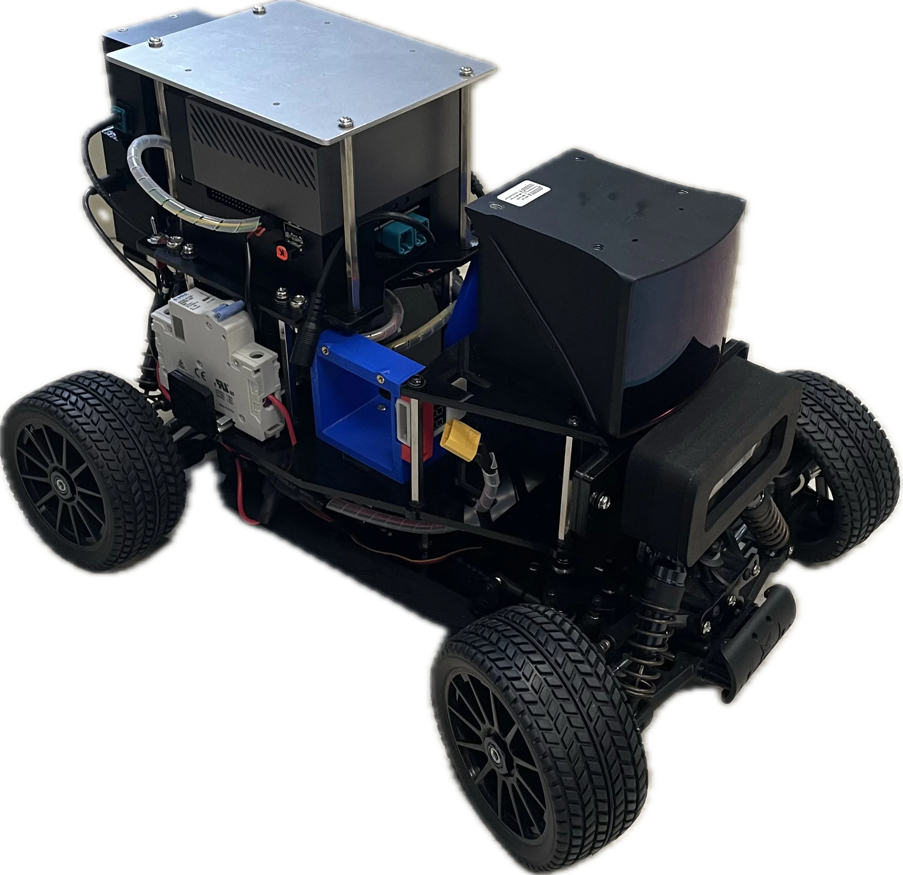
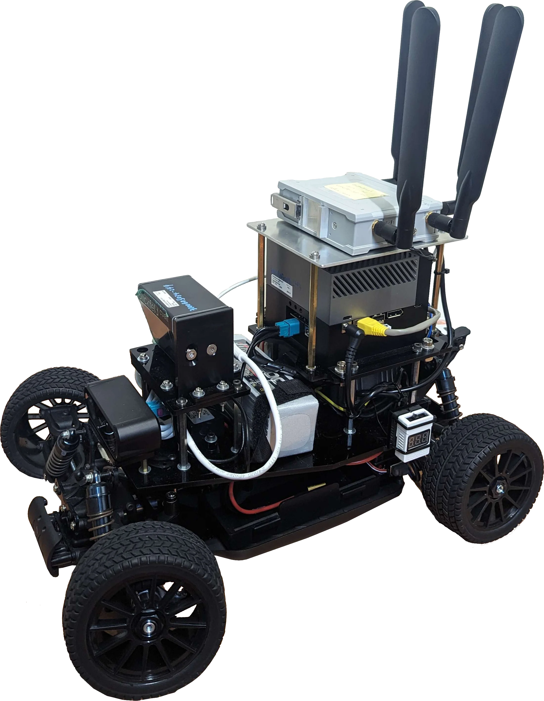

<p align="center">
  
  <br>
  <a href="https://newslabntu.github.io/autosdv-book/">
    <strong>Read the Book »</strong>
  </a>
</p>

AutoSDV project provides a recommended build for a small-scale
autonomous vehicle, equipped with practical, industry-standard sensors
and running Autoware, the leading open-source autonomous driving
platform. Designed for research, development, and education, the
platform offers an affordable, modular solution that enables realistic
experimentation and rapid prototyping in autonomous driving
technologies.

<table align="center" border="0">
  <tr>
    <td align="center" valign="bottom">
      
    </td>
    <td align="center" valign="bottom">
      
    </td>
    <td align="center" valign="bottom">
      
    </td>
  </tr>
  <tr>
    <td align="center">
      <b>Robin-W Solid-State LiDAR Kit</b>
    </td>
    <td align="center">
      <b>Velodyne 32C LiDAR Kit</b>
    </td>
    <td align="center">
      <b>Cube1 LiDAR + MOXA 5G Kit</b>
    </td>
  </tr>
</table>

## Releases

This project is released based on avaialble Autoware releases.

- [2025.02](https://github.com/NEWSLabNTU/AutoSDV/tree/2025.02)
- [2024.11](https://github.com/NEWSLabNTU/AutoSDV/tree/2024.11)
- [2024.02](https://github.com/NEWSLabNTU/AutoSDV/tree/2024.02)

Please download and checkout to the release branch using this command.

```sh
git clone -b 2025.02 --recurse-submodules https://github.com/NEWSLabNTU/AutoSDV.git
```

## License

This project is distributed under Apache 2.0 license in the [license
file](LICENSE.txt). If you use this project in your work, please cite
it as follows:

```latex
@misc{autosdv2025,
  author = {Hsiang-Jui Lin, Chi-Sheng Shih},
  title = {AutoSDV: A Software-Defined Vehicle Platform for Research and Education},
  year = {2025},
  institution = {National Taiwan University},
  url = {https://github.com/yourusername/autosdv},
  note = {Accessed: 2025-04-28}
}
