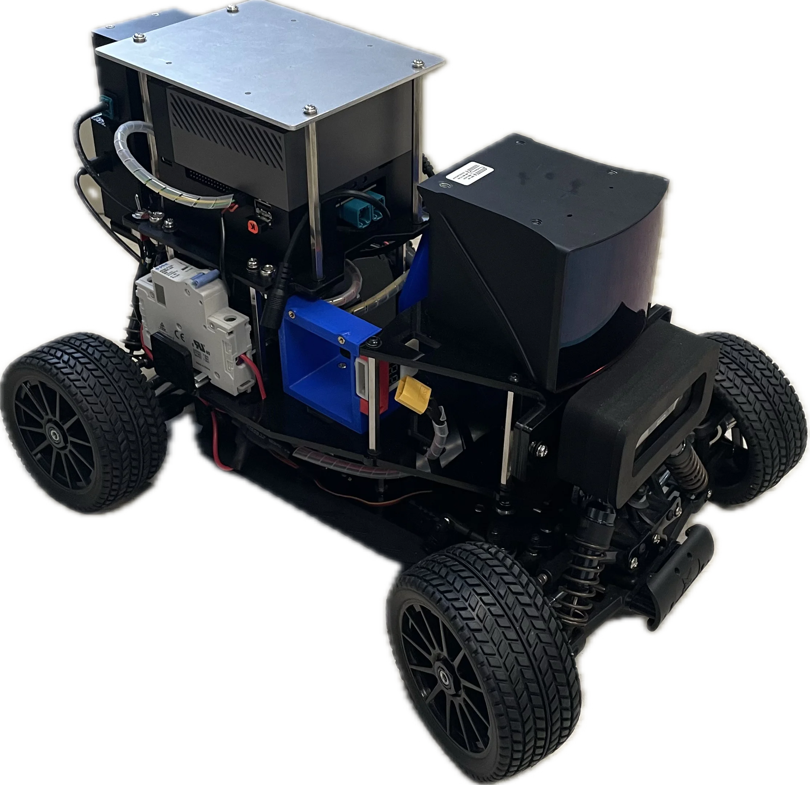
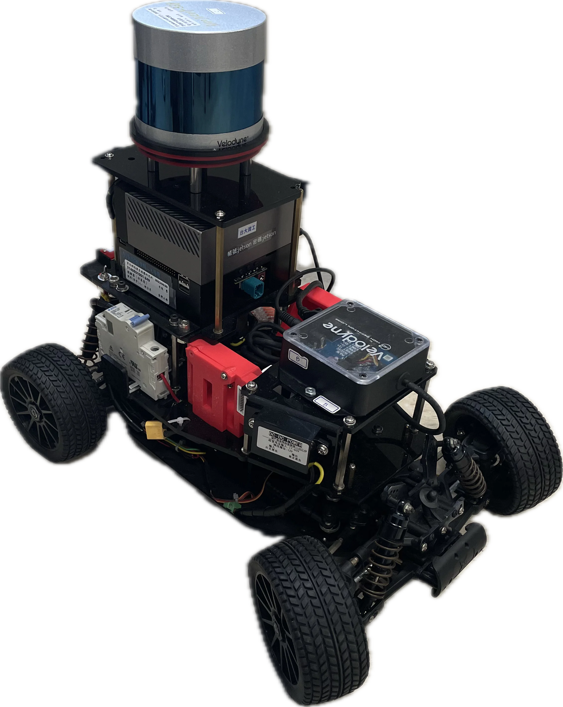
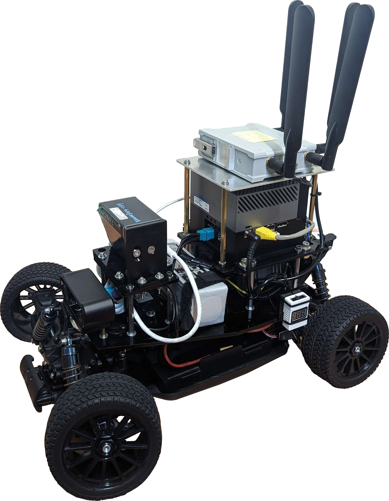

<p align="center">
  
  <br>
  <a href="https://newslabntu.github.io/autosdv-book/">
    <strong>Read the Book »</strong>
  </a>
</p>

AutoSDV project provides a recommended build for a small-scale
autonomous vehicle, equipped with practical, industry-standard sensors
and running Autoware, the leading open-source autonomous driving
platform. Designed for research, development, and education, the
platform offers an affordable, modular solution that enables realistic
experimentation and rapid prototyping in autonomous driving
technologies.

<table align="center" border="0">
  <tr>
    <td align="center" valign="bottom">
      
    </td>
    <td align="center" valign="bottom">
      
    </td>
    <td align="center" valign="bottom">
      
    </td>
  </tr>
  <tr>
    <td align="center">
      <b>Robin-W Solid-State LiDAR Kit</b>
    </td>
    <td align="center">
      <b>Velodyne 32C LiDAR Kit</b>
    </td>
    <td align="center">
      <b>Cube1 LiDAR + MOXA 5G Kit</b>
    </td>
  </tr>
</table>

## Quick Start

AutoSDV uses [Just](https://just.systems) for command running. Run `just` to see all available commands.

```bash
./setup.sh    # Interactive setup (first time)
just build    # Build all packages
just launch   # Launch AutoSDV system
```

See [`.justfile-reference.md`](.justfile-reference.md) for complete command reference.

## Releases

AutoSDV uses [Semantic Versioning](https://semver.org/). All version dependencies are defined in [`versions.yaml`](versions.yaml).

| Version                                                             | Autoware | CUDA (x86) | JetPack | Status      |
|---------------------------------------------------------------------|----------|------------|---------|-------------|
| [v0.1.0](https://github.com/NEWSLabNTU/AutoSDV/releases/tag/v0.1.0) | 1.5.0 | 12.4 | 6.2 | Stable |
| [develop](https://github.com/NEWSLabNTU/AutoSDV/tree/develop)       | 1.5.0    | 12.4       | 6.2     | Development |

### Installation

**Stable release:**
```sh
git clone -b v0.1.0 --recurse-submodules git@github.com:NEWSLabNTU/AutoSDV.git
```

**Development version:**
```sh
git clone -b develop --recurse-submodules git@github.com:NEWSLabNTU/AutoSDV.git
```

### Legacy Releases

Previous releases based on Autoware version naming:
- [2025.02](https://github.com/NEWSLabNTU/F1EIGHTH/tree/2025.02)
- [2024.11](https://github.com/NEWSLabNTU/F1EIGHTH/tree/2024.11)
- [2024.02](https://github.com/NEWSLabNTU/F1EIGHTH/tree/2024.02)

## License

This project is distributed under Apache 2.0 license in the [license
file](LICENSE.txt). If you use this project in your work, please cite
it as follows:

```latex
@misc{autosdv150,
  author = {Hsiang-Jui Lin, Chi-Sheng Shih},
  title = {AutoSDV: A Software-Defined Vehicle Platform for Research and Education (Autoware 1.5.0)},
  year = {2026},
  institution = {National Taiwan University},
  url = {https://github.com/NEWSLabNTU/AutoSDV},
  note = {Accessed: 2026-01-22}
}
```
