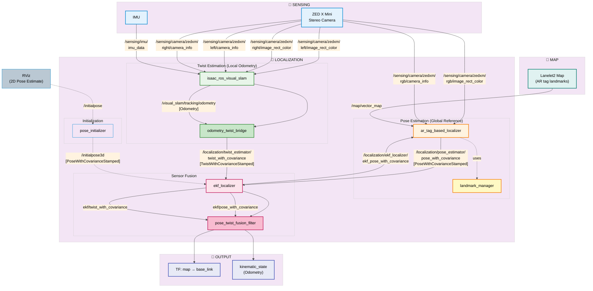

# AR Tag + Isaac Visual SLAM Integration Roadmap

**Document Version:** 1.0
**Date:** 2025-12-22
**Status:** Planning Phase

## Executive Summary

This document provides a comprehensive roadmap for integrating AR Tag-based global localization with Isaac Visual SLAM to solve the global reference problem in camera-only localization for AutoSDV.

**Problem Statement:**
- Isaac Visual SLAM provides excellent local visual odometry but lacks global map reference
- Accumulated drift over time causes pose estimation errors
- Need camera-only solution (YabLoc requires road marking maps unavailable in our field)

**Proposed Solution:**
- Use AR Tag-based localization for global reference (periodic corrections)
- Use Isaac Visual SLAM for local odometry (high-rate smooth tracking)
- Fuse both sources in EKF Localizer for drift-free global pose

---

## Table of Contents

1. [System Architecture](#system-architecture)
2. [Implementation Phases](#implementation-phases)
3. [Detailed Task Breakdown](#detailed-task-breakdown)
4. [Testing Strategy](#testing-strategy)
5. [Dependencies & Requirements](#dependencies--requirements)
6. [Risk Assessment](#risk-assessment)
7. [Timeline & Milestones](#timeline--milestones)

---

## System Architecture

### Current State (Isaac VSLAM Only)

```
┌──────────────────────────────────────────────┐
│  Isaac Visual SLAM                           │
│  - Stereo camera input                       │
│  - cuVSLAM processing                        │
│  - Outputs: Visual odometry (local frame)    │
└──────────────┬───────────────────────────────┘
               │
               ▼
┌──────────────────────────────────────────────┐
│  odometry_pose_bridge                        │
│  - Converts odometry → pose                  │
│  - Outputs: /localization/pose_with_cov      │
└──────────────┬───────────────────────────────┘
               │
               ▼
┌──────────────────────────────────────────────┐
│  EKF Localizer                               │
│  - Treats Isaac VSLAM as global pose source  │
│  - Problem: DRIFT accumulation               │
└──────────────────────────────────────────────┘
```

**Issue:** No global reference → unbounded drift

### Target State (AR Tag + Isaac VSLAM Fusion)

```
┌─────────────────────────────────────────────────────────────┐
│                    GLOBAL REFERENCE                          │
│  ┌──────────────────────────────────────────────────────┐   │
│  │  AR Tag Localizer (Autoware Component)              │   │
│  │  - Camera image input                                │   │
│  │  - ArUco marker detection                            │   │
│  │  - Landmark map matching (Lanelet2)                  │   │
│  │  - Outputs: /localization/pose_estimator/pose (10Hz)│   │
│  └──────────────────────────────────────────────────────┘   │
└─────────────────────────────────────────────────────────────┘
                              │
                              ├────────────────────────┐
                              │                        │
┌─────────────────────────────▼─────────────────────┐  │
│                LOCAL ODOMETRY                      │  │
│  ┌────────────────────────────────────────────┐   │  │
│  │  Isaac Visual SLAM                         │   │  │
│  │  - Stereo camera input                     │   │  │
│  │  - cuVSLAM processing                      │   │  │
│  │  - Outputs: Visual odometry                │   │  │
│  └────────────┬───────────────────────────────┘   │  │
│               ▼                                    │  │
│  ┌────────────────────────────────────────────┐   │  │
│  │  odometry_twist_bridge (NEW)               │   │  │
│  │  - Converts odometry → twist/velocity      │   │  │
│  │  - Outputs: /localization/twist_with_cov   │   │  │
│  └────────────────────────────────────────────┘   │  │
└───────────────────────────┬────────────────────────┘  │
                            │                           │
                            ▼                           │
┌─────────────────────────────────────────────────────────┐
│                      EKF LOCALIZER                       │
│  - Fuses: Global pose (AR tags) + Local twist (VSLAM)   │
│  - Periodic AR tag corrections prevent drift             │
│  - High-rate VSLAM provides smooth tracking              │
│  - Outputs: map → base_link TF (drift-corrected)         │
└──────────────────────────────────────────────────────────┘
```

**Key Benefits:**
- ✅ Global map reference from AR tags
- ✅ Smooth high-rate tracking from Isaac VSLAM
- ✅ Drift-free pose estimation
- ✅ Camera-only solution (no LiDAR/GPS needed)

### Detailed Node Diagram

The following diagram shows the complete node architecture with topic flows based on Autoware's localization system:



**Diagram Legend:**
- **🔹 SENSING** (Blue): Hardware sensors providing raw data
- **Pose Estimation** (Orange): AR tag-based global localization
- **Twist Estimation** (Green): Isaac VSLAM local odometry
- **Sensor Fusion** (Pink): EKF and pose/twist fusion
- **🔹 MAP** (Teal): Lanelet2 map with AR tag landmarks
- **🔹 OUTPUT** (Indigo): Final localization outputs (TF, odometry)

**Key Data Flows:**
1. **Camera → AR Tag Localizer**: RGB image for marker detection
2. **Camera → Isaac VSLAM**: Stereo images for visual odometry
3. **IMU → Isaac VSLAM**: Inertial data for VIO fusion
4. **Map → AR Tag Localizer**: Landmark positions for pose calculation
5. **AR Tag → EKF**: Global pose corrections (periodic, ~10 Hz)
6. **Isaac VSLAM → EKF**: Local twist/velocity (continuous, ~30 Hz)
7. **EKF → AR Tag**: Validation feedback (reject outliers)
8. **EKF → Pose/Twist Filter**: Smoothed estimates for output

---

## Implementation Phases

### Phase 1: Setup & Preparation
**Goal:** Prepare infrastructure and test environment

- [ ] Review AR tag localizer documentation
- [ ] Acquire AprilTag 16h5 markers (physical or printable)
- [ ] Set up test environment with known coordinate frame
- [ ] Install required dependencies

**Deliverables:**
- Printed AR tags (0.6m × 0.6m recommended)
- Test area coordinate frame defined
- Dependencies verified

**Estimated Duration:** 1-2 days

---

### Phase 2: AR Tag Map Creation
**Goal:** Create Lanelet2 map with AR tag landmarks

- [ ] Place AR tags in test environment
- [ ] Measure tag corner positions (global coordinates)
- [ ] Create/modify Lanelet2 .osm map file
- [ ] Validate map format and coordinates

**Deliverables:**
- Lanelet2 map with AR tag landmarks
- Tag placement documentation
- Coordinate measurement spreadsheet

**Estimated Duration:** 2-3 days

---

### Phase 3: AR Tag Localizer Integration
**Goal:** Enable and test AR tag detection

- [ ] Configure AR tag localizer parameters
- [ ] Update AutoSDV launch files for AR tag support
- [ ] Add camera topic remapping
- [ ] Test standalone AR tag detection

**Deliverables:**
- Configured `ar_tag_based_localizer.param.yaml`
- Updated launch files
- Validation test results

**Estimated Duration:** 1-2 days

---

### Phase 4: Isaac VSLAM Modification
**Goal:** Convert Isaac VSLAM from pose source to twist source

- [ ] Modify `odometry_pose_bridge` to output twist
- [ ] Update topic names and message types
- [ ] Test Isaac VSLAM twist output
- [ ] Validate twist accuracy

**Deliverables:**
- Modified `odometry_pose_bridge` node (or new `odometry_twist_bridge`)
- Updated package dependencies
- Twist validation test results

**Estimated Duration:** 2-3 days

---

### Phase 5: EKF Fusion Configuration
**Goal:** Configure EKF to fuse AR tag pose + Isaac VSLAM twist

- [ ] Configure EKF localizer parameters
- [ ] Set up topic remapping for dual sources
- [ ] Tune covariance matrices
- [ ] Test fusion behavior

**Deliverables:**
- Configured EKF parameters
- Tuned covariance values
- Fusion test results

**Estimated Duration:** 2-3 days

---

### Phase 6: System Integration Testing
**Goal:** Validate complete system in realistic scenarios

- [ ] Test with camera data (rosbag or live hardware)
- [ ] Verify drift correction when AR tags detected
- [ ] Measure localization accuracy
- [ ] Stress test edge cases (no tags visible, etc.)

**Deliverables:**
- Integration test results
- Performance metrics
- Known limitations documentation

**Estimated Duration:** 3-5 days

---

### Phase 7: Documentation & Deployment
**Goal:** Finalize documentation and deploy to production

- [ ] Update CLAUDE.md with new configuration
- [ ] Create user guide for AR tag setup
- [ ] Document troubleshooting procedures
- [ ] Create visualization guide for RViz

**Deliverables:**
- Complete documentation
- User setup guide
- Troubleshooting guide
- RViz configuration files

**Estimated Duration:** 1-2 days

---

## Detailed Task Breakdown

### Phase 1 Tasks

#### Task 1.1: Review Autoware AR Tag Localizer
**Location:** `~/repos/autoware/2025.02-ws/src/universe/autoware.universe/localization/autoware_landmark_based_localizer/autoware_ar_tag_based_localizer/`

**Actions:**
```bash
# Read documentation
cat ~/repos/autoware/2025.02-ws/src/universe/autoware.universe/localization/autoware_landmark_based_localizer/autoware_ar_tag_based_localizer/README.md

# Review source code
cd ~/repos/autoware/2025.02-ws/src/universe/autoware.universe/localization/autoware_landmark_based_localizer/
find . -name "*.cpp" -o -name "*.hpp" | xargs cat

# Check launch configuration
cat autoware_ar_tag_based_localizer/launch/ar_tag_based_localizer.launch.xml
```

**Acceptance Criteria:**
- Understand input/output topics
- Understand parameter configuration
- Identify integration points

---

#### Task 1.2: Acquire AprilTag Markers
**Marker Specifications:**
- **Family:** AprilTag 16h5
- **IDs:** 0-6 (7 markers minimum)
- **Size:** 0.6m × 0.6m (or 0.4m × 0.4m for smaller areas)
- **Material:** Printed on rigid backing (foam board, cardboard, or laminated paper)

**Generation Methods:**

**Option 1: Online Generator**
```bash
# Visit: https://chev.me/arucogen/
# Settings:
# - Dictionary: AprilTag 16h5
# - Marker ID: 0-6
# - Marker size: 600mm
# - Download each marker as PNG/PDF
```

**Option 2: Python Script**
```bash
# Install OpenCV with ArUco
pip install opencv-contrib-python

# Generate markers
python3 << 'EOF'
import cv2
from cv2 import aruco
import numpy as np

# AprilTag 16h5 dictionary
dict_type = aruco.DICT_APRILTAG_16h5
dictionary = aruco.getPredefinedDictionary(dict_type)

# Generate markers 0-6
for marker_id in range(7):
    # Create 800x800 pixel image
    marker_img = aruco.generateImageMarker(dictionary, marker_id, 800)

    # Add white border (recommended for better detection)
    border_size = 100
    bordered_img = cv2.copyMakeBorder(
        marker_img, border_size, border_size, border_size, border_size,
        cv2.BORDER_CONSTANT, value=255
    )

    # Save
    filename = f'apriltag_16h5_id_{marker_id}.png'
    cv2.imwrite(filename, bordered_img)
    print(f'Generated {filename}')
EOF
```

**Printing:**
- Print at actual size (600mm × 600mm)
- Use high-quality printer (600+ DPI)
- Mount on rigid backing for stability
- Laminate for outdoor durability

**Acceptance Criteria:**
- 7+ AprilTag 16h5 markers generated
- Markers printed and mounted
- Marker IDs clearly labeled on back

---

#### Task 1.3: Define Test Environment Coordinate Frame
**Objective:** Establish a consistent global coordinate system for AR tag placement

**Setup Steps:**

1. **Choose Origin Point:**
   - Select a fixed, easily identifiable location (e.g., corner of room, building corner)
   - Mark physically (e.g., tape, paint marker)

2. **Define Axes:**
   - **X-axis:** Forward/East direction (vehicle forward path)
   - **Y-axis:** Left/North direction (perpendicular to X)
   - **Z-axis:** Up direction (vertical)

3. **Measurement Tools:**
   - Laser distance meter (±1cm accuracy)
   - Total station (for large outdoor areas)
   - Measuring tape (backup)
   - Level for vertical alignment

4. **Document Frame:**
   ```yaml
   coordinate_frame:
     name: "AutoSDV Test Area"
     origin:
       description: "Southwest corner of Building X entrance"
       lat: 25.0xxxxx  # If available
       lon: 121.5xxxxx # If available
     axes:
       x_direction: "East (magnetic heading 90°)"
       y_direction: "North (magnetic heading 0°)"
       z_direction: "Up (gravity-aligned)"
     measurement_unit: "meters"
   ```

**Acceptance Criteria:**
- Origin point physically marked
- Axes clearly defined and documented
- Measurement tools available and calibrated

---

### Phase 2 Tasks

#### Task 2.1: Place AR Tags in Environment
**Placement Strategy:**

**Indoor Environment:**
- **Quantity:** 5-10 tags
- **Height:** 1.5-2.5m (eye level to ceiling)
- **Spacing:** 3-5m apart
- **Orientation:** Facing expected vehicle paths
- **Mounting:** Walls, pillars, stands

**Outdoor Environment:**
- **Quantity:** 7-15 tags
- **Height:** 1.5-3.0m
- **Spacing:** 5-10m apart
- **Orientation:** Facing roads/paths
- **Mounting:** Poles, signposts, building walls

**Coverage Requirements:**
- Vehicle should see ≥1 tag from any location
- Overlapping coverage (≥2 tags visible) preferred
- Clear line of sight, no occlusions
- Stable mounting (no wind movement)

**Placement Checklist:**
```
Tag ID: ___
Location: _____________________
Height above ground: _____ m
Facing direction: _____ degrees
Mounted on: _____________________
Clear visibility: [ ] Yes [ ] No
Photo reference: IMG______.jpg
```

**Acceptance Criteria:**
- All tags placed according to strategy
- Placement documented with photos
- No physical obstructions in camera field of view

---

#### Task 2.2: Measure AR Tag Corner Positions
**Measurement Procedure:**

**Equipment:**
- Laser distance meter
- Clipboard with measurement forms
- Camera for reference photos
- Leveling tool

**For Each Tag:**

1. **Identify Corners:**
   ```
   Looking at tag front:

   Corner 2 -------- Corner 3
       |                |
       |    TAG ID X    |
       |                |
   Corner 1 -------- Corner 4

   Order: Counter-clockwise starting from bottom-left
   ```

2. **Measure Coordinates:**
   - From origin point to each corner
   - Record X, Y, Z in meters
   - Precision: ±0.01m (1cm)

3. **Measurement Template:**
   ```yaml
   tag_id: 0
   marker_type: apriltag_16h5
   size: 0.6  # meters
   corners:
     corner_1:  # Bottom-left
       x: 2.35
       y: 5.12
       z: 1.80
     corner_2:  # Top-left
       x: 2.35
       y: 5.12
       z: 2.40
     corner_3:  # Top-right
       x: 2.95
       y: 5.12
       z: 2.40
     corner_4:  # Bottom-right
       x: 2.95
       y: 5.12
       z: 1.80
   ```

4. **Validation:**
   - Check distances between corners match tag size
   - Verify counter-clockwise order
   - Confirm Z values increase from bottom to top

**Acceptance Criteria:**
- All tag corners measured
- Measurements validated for consistency
- Data recorded in structured format

---

#### Task 2.3: Create Lanelet2 Map with AR Tags
**Map Creation Process:**

**Option 1: Manual OSM Editing (Small Maps)**

Create file: `data/ar_tag_test_map/lanelet2_map.osm`

```xml
<?xml version='1.0' encoding='UTF-8'?>
<osm version='0.6'>
  <!-- Meta information -->
  <MetaInfo format_version="1.0"/>

  <!-- Node definitions for Tag 0 -->
  <node id="1000" lat="25.0xxxxx" lon="121.5xxxxx">
    <tag k="mgrs_code" v="51RUQ12345678"/>
    <tag k="local_x" v="2.35"/>
    <tag k="local_y" v="5.12"/>
    <tag k="ele" v="1.80"/>
  </node>
  <node id="1001" lat="25.0xxxxx" lon="121.5xxxxx">
    <tag k="local_x" v="2.35"/>
    <tag k="local_y" v="5.12"/>
    <tag k="ele" v="2.40"/>
  </node>
  <node id="1002" lat="25.0xxxxx" lon="121.5xxxxx">
    <tag k="local_x" v="2.95"/>
    <tag k="local_y" v="5.12"/>
    <tag k="ele" v="2.40"/>
  </node>
  <node id="1003" lat="25.0xxxxx" lon="121.5xxxxx">
    <tag k="local_x" v="2.95"/>
    <tag k="local_y" v="5.12"/>
    <tag k="ele" v="1.80"/>
  </node>

  <!-- Polygon for Tag 0 -->
  <way id="2000">
    <nd ref="1000"/>
    <nd ref="1001"/>
    <nd ref="1002"/>
    <nd ref="1003"/>
    <tag k="type" v="pose_marker"/>
    <tag k="subtype" v="apriltag_16h5"/>
    <tag k="area" v="yes"/>
    <tag k="marker_id" v="0"/>
  </way>

  <!-- Repeat for tags 1-6 with unique node IDs (1004-1027) and way IDs (2001-2006) -->

</osm>
```

**Option 2: Python Map Generator Script**

Create `scripts/tools/generate_ar_tag_map.py`:

```python
#!/usr/bin/env python3
"""Generate Lanelet2 map with AR tag landmarks from measurement data."""

import yaml
import xml.etree.ElementTree as ET
from xml.dom import minidom

def generate_map(measurement_file, output_file):
    # Load measurements
    with open(measurement_file, 'r') as f:
        data = yaml.safe_load(f)

    # Create OSM structure
    osm = ET.Element('osm', version='0.6')

    # Meta information
    meta = ET.SubElement(osm, 'MetaInfo', format_version='1.0')

    node_id = 1000
    way_id = 2000

    for tag in data['tags']:
        # Create 4 corner nodes
        corner_ids = []
        for corner_name in ['corner_1', 'corner_2', 'corner_3', 'corner_4']:
            corner = tag['corners'][corner_name]
            node = ET.SubElement(osm, 'node', id=str(node_id),
                                 lat='0.0', lon='0.0')  # Dummy lat/lon
            ET.SubElement(node, 'tag', k='local_x', v=str(corner['x']))
            ET.SubElement(node, 'tag', k='local_y', v=str(corner['y']))
            ET.SubElement(node, 'tag', k='ele', v=str(corner['z']))
            corner_ids.append(node_id)
            node_id += 1

        # Create way (polygon)
        way = ET.SubElement(osm, 'way', id=str(way_id))
        for cid in corner_ids:
            ET.SubElement(way, 'nd', ref=str(cid))
        ET.SubElement(way, 'tag', k='type', v='pose_marker')
        ET.SubElement(way, 'tag', k='subtype', v='apriltag_16h5')
        ET.SubElement(way, 'tag', k='area', v='yes')
        ET.SubElement(way, 'tag', k='marker_id', v=str(tag['tag_id']))
        way_id += 1

    # Pretty print
    xml_str = minidom.parseString(ET.tostring(osm)).toprettyxml(indent='  ')

    # Write to file
    with open(output_file, 'w') as f:
        f.write(xml_str)

    print(f"Generated map: {output_file}")

if __name__ == '__main__':
    generate_map('ar_tag_measurements.yaml', 'data/ar_tag_test_map/lanelet2_map.osm')
```

**Acceptance Criteria:**
- Lanelet2 .osm file created
- All AR tags included with correct IDs
- Corner coordinates match measurements
- Map validates with Lanelet2 tools (if available)

---

### Phase 3 Tasks

#### Task 3.1: Configure AR Tag Localizer Parameters
**File:** `src/launcher/autosdv_launch/config/localization/ar_tag_based_localizer.param.yaml`

```yaml
/**:
  ros__parameters:
    # Marker size in meters (must match physical tags)
    marker_size: 0.6

    # Target marker IDs (must match tags in environment)
    target_tag_ids: ['0', '1', '2', '3', '4', '5', '6']

    # Base covariance (will be scaled by detection distance)
    # [x, y, z, roll, pitch, yaw] diagonal values
    base_covariance: [0.2, 0.0, 0.0, 0.0,  0.0,  0.0,
                      0.0, 0.2, 0.0, 0.0,  0.0,  0.0,
                      0.0, 0.0, 0.2, 0.0,  0.0,  0.0,
                      0.0, 0.0, 0.0, 0.02, 0.0,  0.0,
                      0.0, 0.0, 0.0, 0.0,  0.02, 0.0,
                      0.0, 0.0, 0.0, 0.0,  0.0,  0.02]

    # Maximum detection distance (meters)
    distance_threshold: 13.0

    # Use marker orientation for 6DOF pose (false = position-only)
    consider_orientation: false

    # Detection parameters
    detection_mode: "DM_NORMAL"  # DM_NORMAL | DM_FAST | DM_VIDEO_FAST
    min_marker_size: 0.02  # Minimum marker size in image (normalized)

    # EKF validation thresholds
    ekf_time_tolerance: 5.0      # Max time difference (seconds)
    ekf_position_tolerance: 10.0 # Max position difference (meters)
```

**Tuning Guidance:**
- `marker_size`: Measure actual printed tag size
- `distance_threshold`: Camera detection range (test empirically)
- `consider_orientation`: Set to `true` if orientation accuracy needed
- `base_covariance`: Lower values = higher confidence

**Acceptance Criteria:**
- Parameters configured for environment
- Values documented with rationale
- Configuration file committed to repository

---

#### Task 3.2: Update AutoSDV Launch Files
**File:** `src/launcher/autosdv_launch/launch/autosdv.launch.yaml`

**Add AR Tag Localizer Support:**

```yaml
# Localization configuration
- arg:
    name: pose_source
    default: artag
    description: "Localization pose source: ndt|artag|yabloc|eagleye|isaac"

# AR tag specific parameters
- arg:
    name: ar_tag_marker_size
    default: "0.6"
    description: "AR tag physical size in meters"

- arg:
    name: ar_tag_config_file
    default: "$(find-pkg-share autosdv_launch)/config/localization/ar_tag_based_localizer.param.yaml"
    description: "AR tag localizer configuration file"
```

**Include AR Tag Launch:**

Create `src/launcher/autosdv_launch/launch/localization/ar_tag.launch.xml`:

```xml
<launch>
  <!-- AR Tag Based Localizer -->
  <arg name="ar_tag_config_file"/>
  <arg name="lanelet2_map_path"/>

  <include file="$(find-pkg-share autoware_ar_tag_based_localizer)/launch/ar_tag_based_localizer.launch.xml">
    <arg name="param_file" value="$(var ar_tag_config_file)"/>

    <!-- Remap to AutoSDV topics -->
    <arg name="input_lanelet2_map" value="/map/vector_map"/>
    <arg name="input_image" value="/sensing/camera/zedxm/zed_node/rgb/image_rect_color"/>
    <arg name="input_camera_info" value="/sensing/camera/zedxm/zed_node/rgb/camera_info"/>
    <arg name="input_ekf_pose" value="/localization/ekf_localizer/ekf_pose_with_covariance"/>

    <arg name="output_pose_with_covariance" value="/localization/pose_estimator/pose_with_covariance"/>
  </include>
</launch>
```

**Conditional Launch in Main File:**

```yaml
# In autosdv.launch.yaml, add conditional group
- group:
    if: $(eval "'$(var pose_source)' == 'artag'")
    push-ros-namespace: false

  children:
    - include:
        file: $(find-pkg-share autosdv_launch)/launch/localization/ar_tag.launch.xml
        arg:
          - name: ar_tag_config_file
            value: $(var ar_tag_config_file)
          - name: lanelet2_map_path
            value: $(var map_path)
```

**Acceptance Criteria:**
- Launch files created
- Topic remapping verified
- Conditional launch logic tested
- No launch errors with `pose_source:=artag`

---

### Phase 4 Tasks

#### Task 4.1: Modify odometry_pose_bridge for Twist Output
**Current Implementation:** `src/localization/odometry_pose_bridge/src/odometry_pose_bridge.cpp`

**Changes Needed:**

1. **Add Twist Publisher:**
```cpp
// In class declaration
rclcpp::Publisher<geometry_msgs::msg::TwistWithCovarianceStamped>::SharedPtr twist_pub_;

// In constructor
twist_pub_ = create_publisher<geometry_msgs::msg::TwistWithCovarianceStamped>(
    "/localization/twist_estimator/twist_with_covariance", 10);
```

2. **Extract Twist from Odometry:**
```cpp
void odometry_callback(const nav_msgs::msg::Odometry::SharedPtr msg)
{
    // Existing pose conversion...

    // NEW: Extract and publish twist
    geometry_msgs::msg::TwistWithCovarianceStamped twist_msg;
    twist_msg.header = msg->header;
    twist_msg.header.frame_id = "base_link";  // Twist in vehicle frame
    twist_msg.twist.twist = msg->twist.twist;
    twist_msg.twist.covariance = msg->twist.covariance;

    twist_pub_->publish(twist_msg);
}
```

3. **Add Launch Parameter for Mode Selection:**
```xml
<!-- In odometry_pose_bridge.launch.xml -->
<arg name="output_mode" default="pose" description="pose|twist|both"/>

<node pkg="odometry_pose_bridge" exec="odometry_pose_bridge_node" ...>
  <param name="output_mode" value="$(var output_mode)"/>
</node>
```

**Alternative: Create Separate Node**

If you prefer not to modify existing code, create `odometry_twist_bridge`:

```bash
cd src/localization
cp -r odometry_pose_bridge odometry_twist_bridge

# Modify package.xml, CMakeLists.txt, source files
# Change all references from "pose" to "twist"
```

**Acceptance Criteria:**
- Code compiles successfully
- Twist messages published on correct topic
- Twist values validated against odometry input
- Mode parameter functional

---

#### Task 4.2: Update Isaac VSLAM Launch Configuration
**File:** `src/localization/autosdv_isaac_slam_launch/launch/autosdv_isaac_slam.launch.py`

**Modify Bridge Launch:**

```python
# Change output mode to twist
odometry_bridge_node = Node(
    package='odometry_pose_bridge',
    executable='odometry_pose_bridge_node',
    name='isaac_vslam_twist_bridge',
    parameters=[{
        'output_mode': 'twist',  # NEW: Output twist instead of pose
        'target_frame': 'base_link',
        'covariance_scale': 1.0
    }],
    remappings=[
        ('input/odometry', '/visual_slam/tracking/odometry'),
        ('output/twist_with_covariance', '/localization/twist_estimator/twist_with_covariance')
    ]
)
```

**Acceptance Criteria:**
- Launch file updated
- Twist topic published correctly
- No duplicate pose publishers

---

### Phase 5 Tasks

#### Task 5.1: Configure EKF Localizer for Multi-Source Fusion
**File:** `src/launcher/autoware_launch/autoware_launch/config/localization/ekf_localizer/ekf_localizer.param.yaml`

**Key Parameters:**

```yaml
/**:
  ros__parameters:
    # Pose measurement from AR tags (global reference)
    pose_frame_id: "map"

    # Enable pose and twist measurements
    pose_additional_delay: 0.0
    twist_additional_delay: 0.0

    # Process noise (system dynamics uncertainty)
    proc_stddev_vx_c: 5.0       # Longitudinal velocity
    proc_stddev_wz_c: 1.0       # Yaw rate
    proc_stddev_yaw_c: 0.005    # Yaw angle drift

    # Measurement smoothing (prevent sudden jumps)
    pose_smoothing_steps: 5     # Smooth AR tag corrections over 5 steps
    twist_smoothing_steps: 2    # Smooth twist over 2 steps

    # Measurement gates (reject outliers)
    pose_gate_dist: 10000.0     # Large value (trust AR tags)
    twist_gate_dist: 10000.0    # Large value (trust Isaac VSLAM)

    # Automatic yaw bias estimation
    enable_yaw_bias_estimation: true
    extend_state_step: 50

    # Debug output
    show_debug_info: true
    publish_tf: true
```

**Topic Subscriptions:**
```yaml
# EKF subscribes to:
# - /localization/pose_estimator/pose_with_covariance (from AR tags)
# - /localization/twist_estimator/twist_with_covariance (from Isaac VSLAM)
```

**Covariance Tuning Guide:**

AR Tag Pose Covariance (from AR tag localizer config):
- Close range (<5m): Low uncertainty (0.2m)
- Far range (>5m): Higher uncertainty (scales cubically)

Isaac VSLAM Twist Covariance (from odometry bridge):
- Linear velocity: 0.1 m/s
- Angular velocity: 0.05 rad/s

**Acceptance Criteria:**
- EKF parameters configured
- Covariances tuned for sensor characteristics
- No filter divergence in simulation

---

#### Task 5.2: Test EKF Fusion Behavior
**Test Scenarios:**

**Test 1: AR Tag Correction**
```bash
# Launch system
ros2 launch autosdv_launch autosdv.launch.yaml pose_source:=artag

# Monitor topics
ros2 topic echo /localization/pose_estimator/pose_with_covariance  # AR tag
ros2 topic echo /localization/twist_estimator/twist_with_covariance  # VSLAM
ros2 topic echo /localization/pose_with_covariance  # EKF output

# Expected: When AR tag detected, pose should snap to corrected value
```

**Test 2: Smooth Tracking Between Tags**
```bash
# Move vehicle between AR tag detections
# Expected: Smooth interpolation using Isaac VSLAM twist
```

**Test 3: No Tag Scenario**
```bash
# Move to area without visible AR tags
# Expected: EKF continues using last known pose + VSLAM twist integration
# Watch for drift accumulation
```

**Acceptance Criteria:**
- AR tag corrections applied to EKF
- Smooth tracking between tag detections
- No filter instabilities or crashes

---

### Phase 6 Tasks

#### Task 6.1: Create Integration Test Suite
**Test File:** `src/localization/autosdv_isaac_slam_launch/test/test_ar_tag_fusion.py`

```python
#!/usr/bin/env python3
"""Integration tests for AR Tag + Isaac VSLAM fusion."""

import unittest
import rclpy
from rclpy.node import Node
from geometry_msgs.msg import PoseWithCovarianceStamped
from nav_msgs.msg import Odometry

class TestARTagFusion(unittest.TestCase):
    def test_ar_tag_detection(self):
        """Test AR tag detection and pose publication."""
        # TODO: Implement test logic
        pass

    def test_vslam_twist_output(self):
        """Test Isaac VSLAM twist output."""
        # TODO: Implement test logic
        pass

    def test_ekf_fusion(self):
        """Test EKF fusion of AR tag pose + VSLAM twist."""
        # TODO: Implement test logic
        pass

if __name__ == '__main__':
    unittest.main()
```

**Acceptance Criteria:**
- Test suite created
- At least 3 integration tests implemented
- Tests pass in CI/local environment

---

#### Task 6.2: Rosbag-based Testing
**Objective:** Test with recorded camera data

**Recording:**
```bash
# Record test data
ros2 bag record -o ar_tag_test_data \
  /sensing/camera/zedxm/zed_node/rgb/image_rect_color \
  /sensing/camera/zedxm/zed_node/rgb/camera_info \
  /sensing/imu/imu_data \
  /tf /tf_static

# Duration: 2-5 minutes of driving in test area
```

**Playback Testing:**
```bash
# Play bag and test localization
ros2 launch autosdv_launch autosdv.launch.yaml pose_source:=artag &
ros2 bag play ar_tag_test_data

# Monitor localization accuracy
ros2 run tf2_ros tf2_echo map base_link
```

**Acceptance Criteria:**
- Test rosbag recorded
- Playback successful
- Localization outputs validated

---

### Phase 7 Tasks

#### Task 7.1: Update CLAUDE.md Documentation
**File:** `CLAUDE.md`

**Add Section:**

```markdown
### AR Tag-Based Localization (Camera-Only Global Reference)

AutoSDV supports AR Tag-based localization for camera-only global reference, ideal for GPS-denied environments.

**How It Works:**
- AprilTag 16h5 markers placed at known locations
- Camera detects tags and calculates vehicle pose
- Fused with Isaac Visual SLAM for drift-free tracking

**Configuration:**
```bash
# Enable AR tag localization
make launch ARGS="pose_source:=artag map_path:=./data/ar_tag_test_map"
```

**Setup Requirements:**
1. Print AprilTag 16h5 markers (0.6m × 0.6m)
2. Place markers in environment
3. Measure tag corner positions (global coordinates)
4. Create Lanelet2 map with tag landmarks

**Map Format:**
See `docs/ar_tag_isaac_vslam_integration_roadmap.md` for details.

**Parameters:**
- `marker_size`: Physical tag size (default: 0.6m)
- `target_tag_ids`: Marker IDs to detect (default: ['0'-'6'])
- `distance_threshold`: Max detection range (default: 13m)

**Fusion with Isaac Visual SLAM:**
```bash
# AR tags for global reference, Isaac VSLAM for local tracking
make launch ARGS="pose_source:=artag twist_source:=isaac"
```

**Monitoring:**
```bash
# Check AR tag detections
ros2 topic echo /diagnostics | grep -A 5 "ar_tag"

# Visualize detected tags
ros2 topic echo /localization/ar_tag_based_localizer/debug/detected_tag

# Monitor pose accuracy
ros2 run tf2_ros tf2_echo map base_link
```
```

**Acceptance Criteria:**
- CLAUDE.md updated with AR tag section
- All configuration options documented
- Examples provided

---

#### Task 7.2: Create AR Tag Setup Guide
**File:** `docs/ar_tag_setup_guide.md`

**Contents:**
1. Introduction
2. Hardware requirements (camera, markers, measurement tools)
3. Marker generation and printing
4. Placement strategy
5. Measurement procedure
6. Map creation workflow
7. Testing and validation
8. Troubleshooting

**Template Structure:**
```markdown
# AR Tag Setup Guide for AutoSDV

## Overview
Step-by-step guide for setting up AR tag-based localization.

## Prerequisites
- ZED X Mini camera (or equivalent stereo camera)
- Printer for A3/A2 size prints
- Laser distance meter (±1cm accuracy)
- Rigid backing material (foam board, cardboard)

## Step 1: Generate AR Tags
[Detailed instructions...]

## Step 2: Place Tags in Environment
[Placement strategy...]

## Step 3: Measure Tag Positions
[Measurement procedure...]

## Step 4: Create Lanelet2 Map
[Map creation workflow...]

## Step 5: Configure and Test
[Configuration and testing...]

## Troubleshooting
[Common issues and solutions...]
```

**Acceptance Criteria:**
- Guide created with all sections
- Screenshots/diagrams included
- Tested by following guide end-to-end

---

## Testing Strategy

### Unit Testing
**Scope:** Individual components

**Tests:**
- [ ] AR tag detection accuracy (distance, angle, lighting)
- [ ] Landmark map parsing (Lanelet2 format validation)
- [ ] Pose calculation accuracy (known tag positions)
- [ ] Twist extraction from Isaac VSLAM odometry
- [ ] EKF fusion logic (covariance handling)

**Tools:**
- ROS 2 test framework (`colcon test`)
- Python unittest
- C++ gtest

---

### Integration Testing
**Scope:** Multi-component interactions

**Tests:**
- [ ] AR tag → EKF data flow
- [ ] Isaac VSLAM → EKF data flow
- [ ] Topic remapping correctness
- [ ] TF tree consistency
- [ ] Coordinate frame transformations

**Tools:**
- Rosbag replay
- RViz visualization
- `ros2 topic` command-line tools

---

### System Testing
**Scope:** Complete system in realistic scenarios

**Test Scenarios:**

**Scenario 1: Static Pose Estimation**
- Place vehicle at known position
- Verify pose accuracy vs ground truth
- Acceptance: <10cm position error, <5° orientation error

**Scenario 2: Moving Vehicle with Tag Visibility**
- Drive through area with visible AR tags
- Monitor drift between tag detections
- Acceptance: No drift accumulation when tags detected

**Scenario 3: Moving Vehicle without Tag Visibility**
- Drive through area without AR tags
- Measure drift over time/distance
- Acceptance: Document drift characteristics (for operator guidance)

**Scenario 4: Tag Re-Detection**
- Drive away from tag, return to same tag
- Verify pose consistency on re-detection
- Acceptance: <20cm position difference

**Scenario 5: Environmental Challenges**
- Test under varying lighting conditions
- Test with partial tag occlusion
- Test at maximum detection distance
- Acceptance: Define operational envelope

---

### Acceptance Testing
**Scope:** User requirements validation

**Criteria:**
- [ ] System operates without GPS/LiDAR (camera-only)
- [ ] Global reference maintained (no unbounded drift)
- [ ] Real-time performance (>10 Hz pose updates)
- [ ] Setup time <1 day for new environment
- [ ] Accuracy suitable for low-speed autonomous navigation

---

## Dependencies & Requirements

### Hardware Requirements

**Essential:**
- [x] ZED X Mini stereo camera (or equivalent)
- [x] NVIDIA GPU (for Isaac ROS Visual SLAM)
- [ ] Laser distance meter (±1cm accuracy)
- [ ] AprilTag 16h5 markers (7+ tags)

**Optional:**
- [ ] Total station (for large outdoor areas)
- [ ] Tripod for camera calibration
- [ ] Level tool for vertical alignment

---

### Software Dependencies

**ROS 2 Packages (Autoware):**
- `autoware_ar_tag_based_localizer` ✅ (in Autoware 2025.02)
- `autoware_landmark_manager` ✅ (in Autoware 2025.02)
- `autoware_ekf_localizer` ✅ (in Autoware 2025.02)
- `aruco` library ✅ (dependency of AR tag localizer)

**Isaac ROS:**
- `isaac_ros_visual_slam` ✅ (already integrated)
- `isaac_ros_image_proc` ✅ (already integrated)

**AutoSDV Packages:**
- `odometry_pose_bridge` ✅ (exists, needs modification)
- `autosdv_isaac_slam_launch` ✅ (exists, needs update)
- `autosdv_launch` ✅ (exists, needs update)

**External Libraries:**
- OpenCV with ArUco support ✅
- ZED SDK 5.x ✅

---

### Map Requirements

**Lanelet2 Map with AR Tags:**
- Format: OSM XML with pose_marker polygons
- Minimum: 5-7 AR tag landmarks
- Coordinate precision: ±1cm
- Validation: Lanelet2 format checker (optional)

**Map Storage:**
- Location: `data/ar_tag_test_map/lanelet2_map.osm`
- Version control: Track in Git (text format)
- Backup: Keep measurement spreadsheet separate

---

## Risk Assessment

### Technical Risks

| Risk | Impact | Probability | Mitigation |
|------|--------|-------------|------------|
| **AR tag detection fails in poor lighting** | High | Medium | Test detection performance at different times of day; add lighting if needed |
| **Isaac VSLAM drift exceeds EKF tolerance** | High | Low | Tune EKF covariances; increase AR tag density |
| **Tag measurement errors cause pose jumps** | High | Medium | Use high-precision measurement tools; validate measurements |
| **Camera calibration drift over time** | Medium | Low | Periodic recalibration; monitor detection accuracy |
| **Duplicate tag IDs cause false positives** | Medium | Low | Careful ID assignment; use `ekf_position_tolerance` validation |
| **EKF divergence with conflicting measurements** | High | Low | Tune covariances; add diagnostic monitoring |

---

### Operational Risks

| Risk | Impact | Probability | Mitigation |
|------|--------|-------------|------------|
| **Tags damaged or moved after mapping** | High | Medium | Regular visual inspection; detect pose inconsistencies |
| **Vehicle operates outside tag coverage area** | Medium | High | Document coverage map; operator training |
| **Setup time exceeds budget** | Low | Medium | Pre-print tags; practice measurement procedure |
| **Map update workflow unclear** | Medium | Medium | Document map update procedure; version control |

---

### Risk Monitoring

**Key Metrics:**
- AR tag detection rate (% of frames with detections)
- Pose jump magnitude (threshold: >0.5m)
- EKF innovation (difference between prediction and measurement)
- System uptime without manual intervention

**Monitoring Tools:**
```bash
# Detection diagnostics
ros2 topic echo /diagnostics --field status[*].message | grep "AR tag"

# Pose jump detection
ros2 topic echo /localization/pose_with_covariance --field pose.pose.position | \
  python3 -c "
import sys
last_pos = None
for line in sys.stdin:
    pos = tuple(map(float, line.split()))
    if last_pos:
        dist = ((pos[0]-last_pos[0])**2 + (pos[1]-last_pos[1])**2)**0.5
        if dist > 0.5:
            print(f'WARN: Pose jump {dist:.2f}m')
    last_pos = pos
"
```

---

## Timeline & Milestones

### Estimated Timeline

**Total Duration:** 2-3 weeks (15-20 working days)

```
Week 1: Setup & Preparation
├─ Days 1-2: Phase 1 (Setup)
├─ Days 3-5: Phase 2 (Map Creation)
└─ Day 5: Milestone 1 - AR Tag Map Complete

Week 2: Integration
├─ Days 6-7: Phase 3 (AR Tag Integration)
├─ Days 8-10: Phase 4 (Isaac VSLAM Modification)
├─ Days 11-12: Phase 5 (EKF Configuration)
└─ Day 12: Milestone 2 - Software Integration Complete

Week 3: Testing & Documentation
├─ Days 13-17: Phase 6 (System Testing)
├─ Days 18-19: Phase 7 (Documentation)
└─ Day 20: Milestone 3 - Production Ready
```

---

### Milestones

#### Milestone 1: AR Tag Map Complete
**Date:** End of Week 1
**Criteria:**
- [ ] AR tags generated and printed
- [ ] Tags placed in environment
- [ ] All tag corners measured
- [ ] Lanelet2 map created and validated

**Deliverables:**
- Lanelet2 .osm map file
- Tag placement documentation
- Measurement data spreadsheet

---

#### Milestone 2: Software Integration Complete
**Date:** End of Week 2
**Criteria:**
- [ ] AR tag localizer configured
- [ ] Isaac VSLAM outputs twist
- [ ] EKF fuses both sources
- [ ] System launches without errors

**Deliverables:**
- Modified `odometry_pose_bridge` (or `odometry_twist_bridge`)
- Updated launch files
- Configuration files

---

#### Milestone 3: Production Ready
**Date:** End of Week 3
**Criteria:**
- [ ] All integration tests pass
- [ ] System tested with real camera data
- [ ] Documentation complete
- [ ] Known limitations documented

**Deliverables:**
- Test results report
- User setup guide
- Updated CLAUDE.md
- Deployment procedures

---

## Success Criteria

### Technical Success

**Must Have:**
- ✅ Camera-only localization (no GPS/LiDAR dependency)
- ✅ Global map reference (no unbounded drift)
- ✅ Real-time performance (>10 Hz pose updates)
- ✅ AR tag detection range >5m
- ✅ Position accuracy <0.5m when tag visible

**Should Have:**
- ✅ Smooth tracking between tag detections
- ✅ Automatic drift correction on tag re-detection
- ✅ Diagnostic monitoring and alerts
- ✅ EKF stability in all test scenarios

**Nice to Have:**
- ✅ Multi-tag fusion (use multiple tags simultaneously)
- ✅ Automatic map generation tools
- ✅ RViz visualization plugins

---

### Operational Success

**Must Have:**
- ✅ Setup time <1 day for new environment
- ✅ No manual interventions during operation
- ✅ Clear documentation for non-experts

**Should Have:**
- ✅ Map update procedure documented
- ✅ Troubleshooting guide complete
- ✅ Performance monitoring tools available

---

## Appendices

### Appendix A: Topic Reference

**Input Topics:**
```
/sensing/camera/zedxm/zed_node/rgb/image_rect_color          # Camera image
/sensing/camera/zedxm/zed_node/rgb/camera_info               # Camera calibration
/visual_slam/tracking/odometry                                # Isaac VSLAM odometry
/map/vector_map                                               # Lanelet2 map
```

**Output Topics:**
```
/localization/pose_estimator/pose_with_covariance             # AR tag pose
/localization/twist_estimator/twist_with_covariance           # Isaac VSLAM twist
/localization/pose_with_covariance                            # EKF fused pose
/localization/ekf_localizer/ekf_twist_with_covariance         # EKF twist output
/tf                                                           # map → base_link transform
```

**Debug Topics:**
```
/localization/ar_tag_based_localizer/debug/image              # Detected tags overlay
/localization/ar_tag_based_localizer/debug/detected_tag       # Tag pose array
/localization/ar_tag_based_localizer/debug/mapped_tag         # Map landmarks
/diagnostics                                                  # System diagnostics
```

---

### Appendix B: Coordinate Frame Definitions

**Global Frames:**
- `map` - Global fixed frame (origin at map reference point)
- `odom` - Odometry frame (may drift from map)

**Vehicle Frames:**
- `base_link` - Vehicle center (on ground plane)
- `camera_link` - Camera optical frame
- `imu_link` - IMU frame

**TF Tree:**
```
map
 └─ base_link (published by EKF Localizer)
     ├─ camera_link (static, from calibration)
     ├─ imu_link (static, from calibration)
     └─ lidar_link (static, from calibration)
```

---

### Appendix C: File Locations

**Configuration Files:**
```
src/launcher/autosdv_launch/config/localization/
  ├─ ar_tag_based_localizer.param.yaml
  └─ ekf_localizer.param.yaml

src/launcher/autosdv_launch/launch/
  ├─ autosdv.launch.yaml
  └─ localization/
      └─ ar_tag.launch.xml

src/localization/autosdv_isaac_slam_launch/launch/
  └─ autosdv_isaac_slam.launch.py
```

**Data Files:**
```
data/ar_tag_test_map/
  ├─ lanelet2_map.osm
  ├─ ar_tag_measurements.yaml
  └─ tag_placement_photos/
```

**Documentation:**
```
docs/
  ├─ ar_tag_isaac_vslam_integration_roadmap.md (this file)
  ├─ ar_tag_setup_guide.md (to be created)
  └─ isaac_ros_visual_slam_integration_plan.md (existing)
```

---

### Appendix D: Reference Materials

**Autoware Documentation:**
- [AR Tag Localizer README](https://github.com/autowarefoundation/autoware.universe/tree/main/localization/autoware_landmark_based_localizer/autoware_ar_tag_based_localizer)
- [Lanelet2 Format Extension](https://github.com/autowarefoundation/autoware.universe/blob/main/common/autoware_lanelet2_extension/docs/lanelet2_format_extension.md)
- [EKF Localizer](https://github.com/autowarefoundation/autoware.universe/tree/main/localization/autoware_ekf_localizer)

**AprilTag Resources:**
- [AprilTag Family 16h5](https://github.com/AprilRobotics/apriltag)
- [Online Tag Generator](https://chev.me/arucogen/)
- [ArUco ROS Package](https://github.com/pal-robotics/aruco_ros)

**Isaac ROS Visual SLAM:**
- [NVIDIA Isaac ROS Visual SLAM](https://nvidia-isaac-ros.github.io/repositories_and_packages/isaac_ros_visual_slam/index.html)
- [cuVSLAM Documentation](https://docs.nvidia.com/isaac/ros/visual_slam/index.html)

---

## Revision History

| Version | Date | Author | Changes |
|---------|------|--------|---------|
| 1.0 | 2025-12-22 | Claude Code | Initial roadmap creation |

---

## Next Steps

**Immediate Actions:**
1. Review this roadmap with team
2. Acquire AR tag printing materials
3. Identify test environment and define coordinate frame
4. Set target date for Milestone 1

**Decision Points:**
- Marker size: 0.6m or 0.4m? (depends on environment size)
- Number of tags: 7 minimum or more? (depends on coverage needs)
- Indoor or outdoor deployment first?
- Modify existing `odometry_pose_bridge` or create new node?

**Questions for Stakeholders:**
- What is the target localization accuracy requirement?
- What is the maximum acceptable setup time for new environments?
- Are there existing coordinate reference points in test area?
- What is the expected operational range (distance from start point)?

---

**For questions or issues during implementation, refer to:**
- Technical lead: [Name]
- Documentation: `docs/ar_tag_setup_guide.md`
- Troubleshooting: CLAUDE.md → AR Tag section
- Support: [Contact info]
