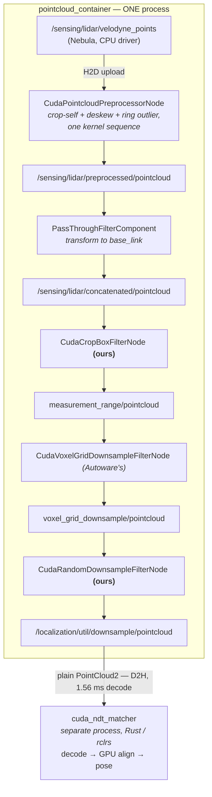

# The CUDA pipeline: what runs where, and where the copies are

Two switches select GPU or CPU for two consecutive stages, and a third selects
the scan matcher. They are independent, each is whole-stage, and none of them
can be half-applied. This document is the map, because the wiring is spread
across a sensor kit launch file, a localization launch file and a Rust package,
and reconstructing it from those takes longer than reading it here.

```bash
just launch pointcloud_backend:=cuda \
            localization_pointcloud_backend:=cuda \
            pose_source:=cuda_ndt
```

| switch | selects | default |
|---|---|---|
| `pointcloud_backend` | sensing: per-LiDAR crop-self, deskew, ring outlier filter | `cpu` |
| `localization_pointcloud_backend` | the NDT input chain: crop, voxel, random downsample | `cpu` |
| `pose_source` | the scan matcher itself | `cuda_ndt` |

Adapted from the golf cart, which runs the same AGX Orin. Where this differs
from that document, it is because AutoSDV has **one** LiDAR and the golf cart
has three; the differences are called out below rather than smoothed over.

---

## Data flow



## Why one container is load-bearing

`cuda_blackboard` is **not a transport**. It is a process-local singleton holding
a map from a `UInt64` instance id to a device pointer. What crosses ROS is that
integer, plus a `negotiated` handshake to agree on the type; the subscriber looks
the pointer up *in its own process*.

So a stage in a different process receives the id and finds nothing behind it.
The sensor kit loads the sensing chain into `pointcloud_container`, and
`tier4_localization_launch`'s `util/util.launch.xml` loads the localization
chain into the same one. That is not tidiness, it is the requirement.

Two consequences worth knowing before moving anything:

- **`localization_pointcloud_backend:=cuda` on its own still works, but is not
  free.** With `pointcloud_backend:=cpu` the concatenated cloud arrives as a
  plain `PointCloud2`; `CudaBlackboardSubscriber` has a compatible-topic
  fallback, so the chain runs, paying a host-to-device copy at its first stage.
- **Halves of one stage cannot mix.** Autoware's own enum has no mixed mode
  either.

## Where the copies are

On this vehicle, three:

1. **H2D at the sensing preprocessor's input.** The driver stays on the CPU in
   both modes — Nebula has no CUDA decoder for Velodyne. Autoware's own
   `pipeline_mode:=cuda` does the same.
2. **D2H at the passthrough.** This is AutoSDV-specific and is the price of
   having one LiDAR; see the next section.
3. **D2H at the matcher's input.** `cuda_ndt_matcher` is an rclrs node: it
   cannot join a C++ component container and cannot read the blackboard. But
   `CudaBlackboardPublisher` also carries a `compatible_pub_` publishing a plain
   `PointCloud2`, so the chain feeds it with no change to it. That compatible
   topic is the copy, and the 1.56 ms decode on the far side.

## Why there is no concatenator here, and what it costs

The golf cart ends its sensing chain with
`CudaPointCloudConcatenateDataSynchronizerComponent`, which also transforms the
result into `base_link`. AutoSDV cannot use it, because it has one LiDAR and
**both** concatenators refuse a single input topic:

```
Component constructor threw an exception:
Only one topic given. Need at least two topics to continue.
```

Listing the same topic twice does load. It was measured, against a synthetic
10 Hz publisher, and it is not an option: the output runs at **1.7–2.4 Hz** and
the node logs `Reset the oldest collector because the number of processing
collectors is equal to the limit of (3)` on every cycle. Each message fills one
slot, the collector waits out `timeout_sec` for a second that never arrives, and
the collector limit thrashes. Roughly 80% of frames are lost.

The golf cart measured the same mechanism from the other direction, on a bag
where one of its two LiDARs is silent: preprocessing held 10.00 Hz while the
concatenated cloud ran at 4.47 Hz, each cloud arriving **p50 190 ms** after its
own header stamp against a 100 ms scan period — that is `timeout_sec: 0.2`, not
compute. Their remedy was a timeout shorter than the scan period, which costs one
short wait per scan instead of a dropped one. It does not help here: with a
single input the concatenator publishes nothing at all, whatever the timeout.

So the chain ends at `PassThroughFilterComponent`, which is what this kit
already used for its single LiDAR and which does the transform to `base_link`
that the CUDA preprocessor does not do — its output stays in the sensor frame.
That node is CPU, so copy (2) above happens there.

What that costs: the per-point work — cropping, deskewing, outlier filtering —
is on the GPU, which is the expensive part. What it does not buy: a
GPU-resident path from driver to matcher. Closing that needs either a second
LiDAR, which makes the CUDA concatenator usable, or a CUDA passthrough, which
upstream does not ship.

## Which LiDARs can be preprocessed at all

**The Velodyne VLP-32C only.** The CUDA node fuses cropping with distortion
correction, and distortion correction needs a per-point time offset. Nebula
publishes `velodyne_points` in the `PointXYZIRCAEDT` layout, which carries one.

`seyond_ros_driver` registers `PointXYZIRC`: x, y, z, intensity, return_type,
ring. No azimuth, no elevation, no distance, no per-point time. A cloud with no
per-point time cannot be deskewed by anything, CPU or GPU, so the Robin-W branch
is not merely un-accelerated, it is uncorrectable until the driver emits
`PointXYZIRCAEDT`. The Blickfeld Cube1 is in the same position.

`pointcloud_backend:=cuda` with either model is **refused with an error naming
the reason**, rather than silently ignored. Phase 2.3 of
`docs/roadmap/6-golfcart-backport.md` adds the field to the Seyond driver; when
it lands, move `robin-w` into `DESKEWABLE` in
`pointcloud_preprocessor.launch.py`.

AutoSDV's default sensor suite is `vlp32c_zed_imu`, so the default configuration
is the one that can use this.

## Source organisation

| stage | package | language |
|---|---|---|
| sensing CUDA chain | `autoware_cuda_pointcloud_preprocessor` (installed, upstream) | C++/CUDA |
| which sensing chain runs | `autosdv_sensor_kit_launch/launch/pointcloud_preprocessor.launch.py` | launch |
| localization CUDA filters | `src/sensing/cuda_pointcloud_filters` | C++/CUDA |
| which localization chain runs | `tier4_localization_launch/launch/util/util.launch.xml` | launch |
| the matcher | `cuda_ndt_matcher/src/{ndt_cuda,cuda_ffi,cuda_ndt_matcher}` | Rust |
| top-level switches | `autosdv_launch/launch/{autosdv,logging_simulation}.launch.yaml` | launch |

`cuda_pointcloud_filters` exists to fill two gaps upstream leaves. Autoware
ships `CudaVoxelGridDownsampleFilterNode`, but no standalone CUDA crop box — the
cropping it has is fused inside `CudaPointcloudPreprocessorNode` and needs a
per-point time field — and no CUDA random downsample at all. Without both, the
localization chain would pay a D2H before the one accelerated stage and an H2D
after it.

Two of its design decisions are worth not undoing:

- Non-finite points are dropped in **both** polarities. Every comparison against
  NaN is false, so a `negative` implemented as `!inside` would keep a NaN point
  and hand it to NDT. The CPU component does not do that, and neither does this.
- The crop box **does not transform frames** and deliberately has no
  `output_frame`. `input_frame` is an assertion: a cloud whose `header.frame_id`
  differs is dropped with an error, because cropping the right box in the wrong
  frame removes the wrong points and nothing downstream would report it.

## The language boundary is the architectural fact

The sensing and localization stages are C++/CUDA in one container. The matcher is
Rust in its own process. Every remaining question about zero-copy on this path is
a question about that boundary, not about CUDA.

## What is measured, and what is not

| | |
|---|---|
| `pointcloud_backend:=cuda` | measured **on the golf cart's Orin**, not here: −23.7 points of container CPU, +33 points of GPU, +465 mW, equal throughput. AutoSDV's chain ends differently (passthrough, not concatenator), so re-measure with `scripts/profiling/`. |
| `localization_pointcloud_backend:=cuda` | **correctness verified, speed never measured.** The CPU chain is ~19% of a core; the CUDA one has not been timed and could be slower. |
| `pose_source:=cuda_ndt` | measured: 30.7 ms per frame against Autoware's 47.0, 3 cm RMSE, 9.0 s initialisation. |
| the filters themselves | 12 unit tests against real device memory, run on this machine's GPU. |
