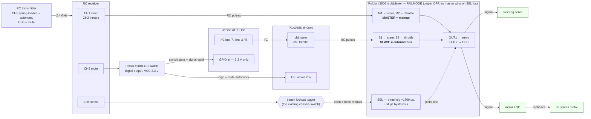
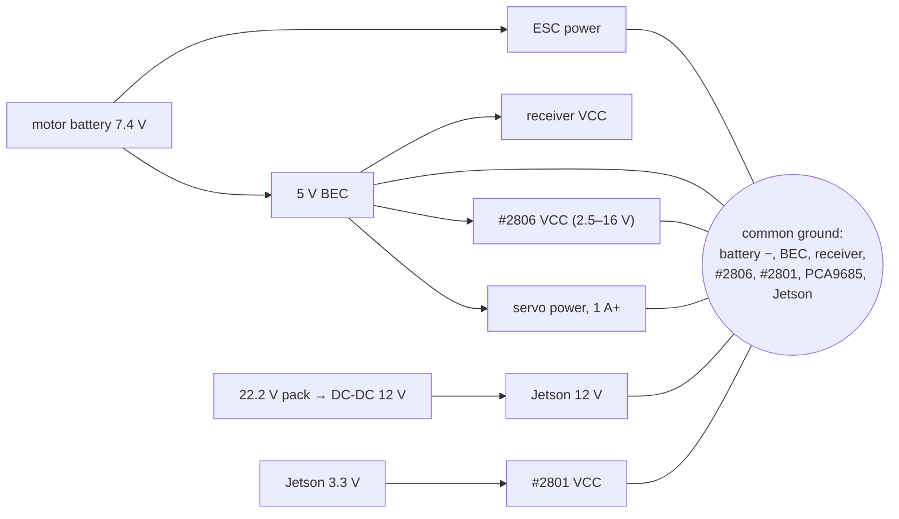

# Manual override and kill switch, in hardware

The vehicle can be driven from the RC transmitter or from the Orin, and today a
**manual toggle on the chassis** decides which. That is safe on a bench and
unsafe in a corridor: while the vehicle is moving under Autoware, nobody can
reach the toggle, so there is no way to take control back. The `actuator.py`
watchdog does not cover the case that matters, because the PCA9685 **latches its
last duty cycle** — if ROS or the Orin dies with throttle applied, the ESC keeps
receiving that pulse indefinitely and the software that was supposed to notice
is the software that died.

This document specifies the wiring that moves the decision to the transmitter.

## 1. Principle

**The manual path is the default, and autonomy is the exception that must be
actively requested.** Every failure — lost radio link, cut wire, unpowered
board, crashed Orin — must land on the manual path or on no pulses at all, never
on "keep doing what the Orin last said".

One consequence is worth stating early: **the primary override is the signal
path, not the power path.** Cutting battery to the ESC leaves a brushless motor
freewheeling — the vehicle coasts, unsteerable. Overriding the signal keeps the
ESC alive, so the driver can command brake (PWM 340). Power cut is the layer
underneath, for when the signal path itself is suspect.

## 2. Wiring

Pin for pin, which is what someone actually wires from:

| from | pin | to | pin | signal |
|---|---|---|---|---|
| RC receiver | CH1 | #2806 | M1 | steering, RC pulses |
| RC receiver | CH2 | #2806 | M2 | throttle, RC pulses |
| RC receiver | CH5 | lockout toggle → #2806 | SEL | mode select |
| RC receiver | CH6 | #2801 | signal in | mute |
| PCA9685 | ch1 | #2806 | S1 | steering, RC pulses |
| PCA9685 | ch0 | #2806 | S2 | throttle, RC pulses |
| #2806 | OUT1 | steering servo | signal | selected steering |
| #2806 | OUT2 | motor ESC | signal | selected throttle |
| #2801 | output | PCA9685 | OE | high mutes all channels |
| #2801 | status | Jetson | GPIO in | override state, 3.3 V |
| Jetson | pins 3 / 5 | PCA9685 | SDA / SCL | I²C bus 7 |

Power and ground, kept separate from the signal graph because sharing a ground
is the thing people forget:

Three electrical constraints that are not negotiable:

- **Common ground across receiver, #2806, PCA9685 and Jetson.** An RC pulse is a
  voltage referenced to ground; without a shared reference the MUX reads noise.
- **`#2801` runs from 3.3 V**, because its digital outputs go straight to Jetson
  GPIO and **Jetson GPIO is not 5 V tolerant**. Powering it from 5 V needs a
  level shifter; powering it from 3.3 V does not.
- **`#2806` and the receiver share the BEC**, so they share a fate. A MUX that
  outlives its receiver is a MUX selecting a dead master.

## 3. Why master = manual

The #2806 measures the pulse width on **SEL**, compares it against a
configurable threshold (≈1700 µs by default, ±64 µs of hysteresis), and routes
the **slave** inputs to the outputs only while SEL is *above* it. With the
FAILMODE jumper left **off**, an invalid or missing SEL signal gives the
**master** inputs control.

So wiring the receiver to M1/M2 and the PCA9685 to S1/S2 makes every failure
mode land where it should:

| event | SEL | drives the ESC | outcome |
|---|---|---|---|
| driver releases the spring switch | low | receiver | manual, and can brake |
| transmitter off or out of range | invalid | receiver | receiver failsafe pulses — set to brake at bind time |
| SEL wire cut, lockout toggle opened | invalid | receiver | manual |
| #2806 loses VCC | — | nobody | no pulses; ESC enters its own failsafe |
| Orin hangs with throttle latched | low on demand | receiver | **the driver takes it back** — the case today's wiring cannot handle |
| radio fine, Autoware misbehaving | driver's choice | receiver | override, brake, then diagnose |

The existing chassis toggle keeps a job: in series with SEL, opening it forces
manual permanently for bench work. A switch that fails open fails safe.

**SEL should come from a spring-loaded (momentary) transmitter switch**, held
for autonomy. A latching toggle works, but a deadman makes the startled
operator's reflex — letting go — the safe action.

## 4. Second layer: the PCA9685 OE pin

`OE` is an active-low output enable: driving it high turns every PCA9685 output
off at the chip, independently of the MUX. A second RC switch (#2801) on CH6
gives the transmitter a way to mute the autonomous path at its source, which
covers the one failure the MUX cannot cover — the MUX itself failing to the
slave side.

The same board's two digital outputs (signal-valid, switch-state) are what the
Orin reads, so the mute and the software's knowledge of it come from one part.

## 5. Third layer: power

Keep a mechanical mushroom button and the anti-spark loop key in the 7.4 V
line. If it should also be RC-actuated, use **#2804** (SPDT relay) driving a
contactor — **not #2803**, whose low-side MOSFET is rated to about 15 A against
an ESC that draws 10–30 A.

Remember what this layer does and does not do: it stops energy, not motion. The
vehicle coasts, and while coasting it does not steer.

## 6. Software the wiring implies

Without these, a clean hardware override still produces a bad hand-back: the
driver takes control, gives it back, and Autoware resumes on a stale trajectory
with a wound-up integrator.

1. Read the #2801 status pin as a **digital level** on a Jetson GPIO and publish
   `/vehicle/override`. Do not decode RC pulse widths on the Orin — it has no
   hardware capture, and an $8 board has already done it.
2. `control_mode_manager.py` reports `MANUAL` while override is asserted.
   `default_to_autonomous: false` is already correct for this.
3. `actuator.py` zeroes the speed-PID integral and the output filter on every
   manual → auto transition. With `ki_speed: 10.0` and `integral_limit: 50.0`, a
   re-engage without that reset dumps a saturated PWM offset immediately.
4. Re-engagement is explicit. Never auto-resume when override clears.
5. Log every transition with a timestamp. That log is the record of what the
   vehicle was doing when someone grabbed control.

## 7. Bench acceptance test

Wheels off the ground, motor battery connected, in this order:

1. SEL low → the transmitter steers and drives.
2. SEL high → Autoware steers and drives; `/vehicle/override` reads false.
3. Transmitter switched **off** mid-autonomy → ESC goes to its failsafe.
4. Pull the SEL wire while autonomous → manual, immediately.
5. CH6 mute while autonomous → outputs dead, vehicle stops.
6. `kill -9` the actuator node with throttle applied, then flip SEL → control
   comes back. **This is the failure the current wiring cannot survive**, so it
   is the test that decides whether the change worked.
7. Hand back to autonomy and watch the first second of PWM. A step means the
   integral reset in §6.3 is missing.

## 8. Parts

| part | role | note |
|---|---|---|
| Pololu #2806 | 4-channel RC servo multiplexer | 2 channels used, 2 spare; VCC 2.5–16 V |
| Pololu #2801 | RC switch, digital output | drives OE, reports state to GPIO; run at 3.3 V |
| Pololu #2804 | RC switch with SPDT relay | optional, for the power layer |
| transmitter | ≥5 channels, one momentary | CH5 select, CH6 mute |

## 9. Documentation drift found while specifying this

`AutoSDV-book` `src/guides/vehicle-control/hardware.md` disagrees with the
vehicle on three numbers, and they should be fixed before students wire
anything from it:

- **I²C bus 1**, where `actuator.yaml` says `i2c_busnum: 7` (and the book's own
  `reference/hardware/wiring-diagrams.md` says bus 7).
- **Steering 350–450, centre 400**, where `actuator.yaml` says
  `min_steer: 439`, `init_steer: 489`, `max_steer: 539`.
- **Motor 280–460**, where `actuator.yaml` says `min_pwm: 360`, `max_pwm: 470`.

Separately, `actuator.yaml` has `wheelbase: 0.340` while
`vehicle_info.param.yaml` has `wheel_base: 0.319`. The Ackermann conversion in
the vehicle interface and the planner therefore disagree about the vehicle;
that is a defect, not drift in prose.

## References

- [Pololu 4-Channel RC Servo Multiplexer #2806](https://www.pololu.com/product/2806)
  and [its user's guide](https://www.pololu.com/docs/0J60/7) (SEL threshold, hysteresis, FAILMODE)
- [Pololu RC Switch with Digital Output #2801](https://www.pololu.com/product/2801)
- [Pololu RC Switch with Relay #2804](https://www.pololu.com/product/2804)
- Book: `src/guides/vehicle-control/hardware.md`, `src/reference/hardware/wiring-diagrams.md`
