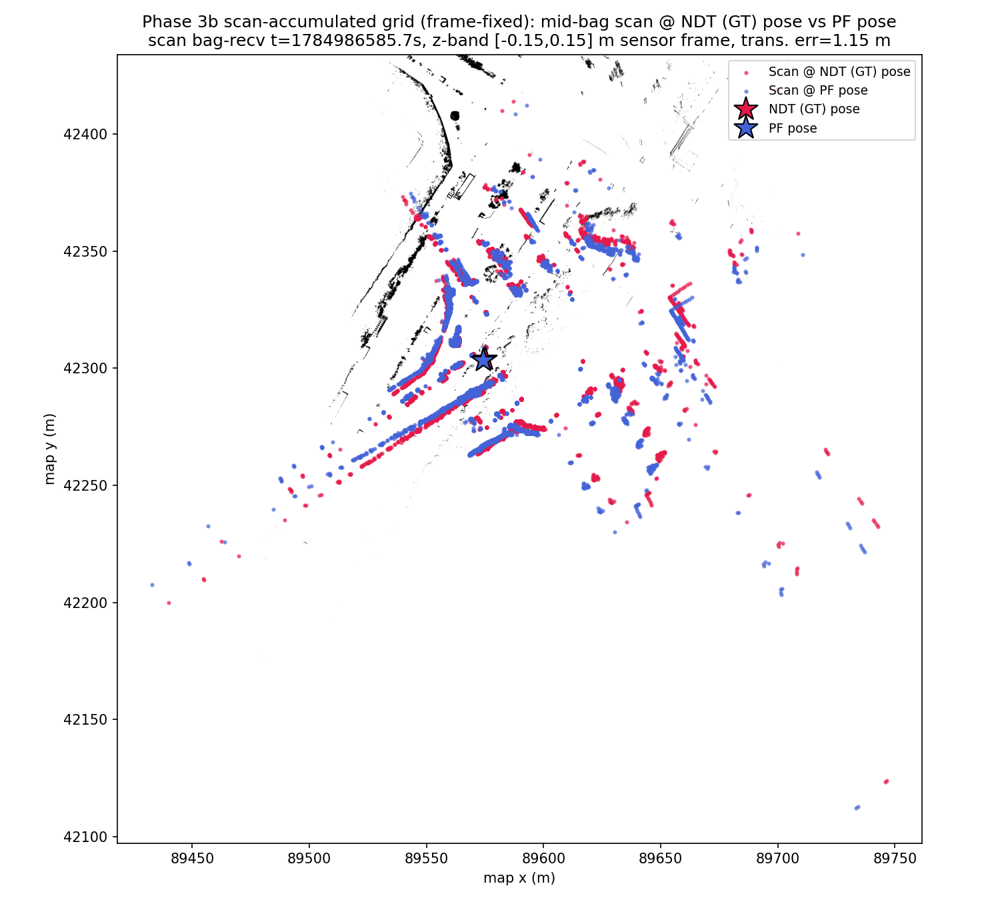

# Phase 3b: Scan-Accumulated Grid + IMU Fix + Scan-Frame Fix — MCL vs NDT Ground Truth

Statistics/thresholds below are auto-generated by `compare_poses.py`
(`--no-motion-window --gt-time-source bag`); re-run to refresh. This
section, Scan Overlay, and Interpretation are hand-written and not
touched by re-running the tool.

- GT bag: `data/rosbags/phase3/sample_ndt_gt`
- PF bag: `data/rosbags/phase3/sample_pf_run_framefix_scanaccum`
- Map: `occupancy_grid_scanaccum.yaml` (same grid as the earlier
  scan-accumulation reports — it was already built with the correct
  sensor→base_link transform applied, so it needed no regeneration)
- Fixes applied: `IMU_YAW_SIGN=-1.0` (see
  `2dlidar-phase3b-scanaccum-imufix.md`) **plus** a second root cause:
  `pointcloud_to_laserscan`'s default `target_frame` is empty, so it
  flattens the cloud in **sensor frame** (`velodyne_top`), not
  `base_link`. `sample_sensor_kit`'s `sensor_kit_base_link ->
  velodyne_top_base_link` static transform has `yaw: 1.575` rad (+90 deg,
  from
  `/opt/autoware/1.5.0/share/sample_sensor_kit_description/config/sensor_kit_calibration.yaml`),
  and `particle_filter` does no tf2 lookups of its own — it assumes
  `/scan` is already expressed in the robot frame. So every sensor update
  PF scored was rotated ~90 deg from the (now-correct) odometry/pose
  frame. Fix: `target_frame:=base_link` on `pointcloud_to_laserscan`
  (transforms via tf2 using `/tf_static` from the bag — verified: the
  scan node's log had zero tf2 lookup errors/warnings for the full run,
  833 `/pf/viz/inferred_pose` messages produced, so the transform
  resolved without needing a `static_transform_publisher` fallback).
  Consequently the z-band filter is now measured in **base_link** frame,
  not sensor frame: `SCAN_MIN_HEIGHT=1.91611` / `SCAN_MAX_HEIGHT=2.21611`
  (sensor z above base_link = 2.0 m [`base_link -> sensor_kit_base_link`]
  + 0.0 m [`sensor_kit_base_link -> velodyne_top_base_link`] + 0.06611 m
  [`velodyne_top_base_link -> velodyne_top`, from the bag's `/tf_static`]
  = **2.06611 m**, ∓ the original 0.15 m sensor-frame band).

## Overall Result: **FAIL**

## Full-Overlap Statistics

| Metric | Value |
|---|---|
| n (pairs) | 817 |
| Trans. mean (m) | 18.9595 |
| Trans. RMS (m) | 39.3589 |
| Trans. max (m) | 132.7761 |
| Trans. p95 (m) | 106.2986 |
| Yaw mean \|err\| (rad) | 0.5746 |
| Yaw max \|err\| (rad) | 2.9613 |

## Motion-Window Statistics

_Motion-window analysis disabled (`--no-motion-window`); this bag moves throughout the recording, so a fixed stationary/motion split is not meaningful here. Only full-overlap statistics are reported._

## Thresholds (applied to full-overlap stats)

| Threshold | Value | Limit | Result |
|---|---|---|---|
| Mean translational error < 1.0 m | 18.9595 | 1.0000 | FAIL |
| p95 translational error < 2.5 m | 106.2986 | 2.5000 | FAIL |
| Mean \|yaw\| error < 0.2 rad | 0.5746 | 0.2000 | FAIL |

## Notes

- Replay rate: 1.0x for both GT and PF recordings, replayed with `--clock` (sim time).
- GT time source: `--gt-time-source=bag` (rosbag2 storage receive-time, used because the GT bag was itself replayed to produce the PF run; see _read_bag() docstring in compare_poses.py for why header.stamp would give zero overlap here).
- PF params: `range_method=cddt`, particle count per vendored `config/localize.yaml` default (4000), `max_range=30.0` (outdoor VLP-32C), `scan_topic=/scan`, `odometry_topic=/odom`.
- Odometry input to PF was synthesized wheel+IMU planar unicycle integration (`scripts/2dlidar/wheel_imu_odom.py`), not a native wheel encoder feed — odometry quality directly affects PF motion-model accuracy between scans.
- GT is Autoware NDT `/localization/kinematic_state`; PF publishes pose in the occupancy-grid frame, which is sliced from the same PCD map as NDT's map frame — poses are directly comparable without a transform.
- Z-band caveat: comparison is 2D (x, y, yaw) only; the GT track's z is Autoware's 3D NDT estimate while PF is inherently 2D, so z is not compared.
- `/scan` was bridged from `/sensing/lidar/velodyne_points` via `pointcloud_to_laserscan` with a z-band filter (see Task 3); QoS was bridged from `pointcloud_to_laserscan`'s best-effort publisher to `particle_filter`'s reliable-QoS subscription.
- **Diagnostic note (not a fix):** the run above FAILs the Phase 3 gate. Full-overlap trans. mean=18.96 m, p95=106.30 m, yaw mean|err|=0.575 rad (thresholds: mean<1.0 m, p95<2.5 m, yaw<0.2 rad). Plausible contributors: (1) the synthesized wheel+IMU odometry feeding PF's motion model has no absolute correction and can accumulate heading error, which a particle filter with too few effective particles or a poor sensor model may fail to correct via scan matching; (2) `range_method=cddt` / particle count / sensor-model noise parameters were carried over from vendored defaults and may not be tuned for this scenario; (3) possible scan-to-map mismatches (z-band filter choice, `max_range`) reducing effective localization likelihood signal; (4) ground-truth quality itself (see report notes on the GT source) may be a contributing factor. PF parameter tuning is explicitly out of scope for this gate and is deferred to a Phase-3 follow-up.

## Scan Overlay

Mid-bag scan overlaid on the scan-accumulated grid at NDT (GT) pose vs PF
pose (static-TF-aware projection, dt<=0.02s both sides — methodology
unchanged from earlier reports; this figure verifies the pipeline, it
does not itself depend on the pointcloud_to_laserscan frame-fix, which
only affects PF's internal `/scan`).

At this mid-bag instant GT yaw=0.650 rad vs PF yaw=0.589 rad (diff 0.061
rad) — much tighter than the pre-frame-fix runs, consistent with the
large drop in full-run yaw mean|err| (1.318 -> 0.575 rad).

## Interpretation

**Both fixes compound: yaw error collapses, translational error keeps
improving.** Relative to the IMU-fix-only run on this same map
(`2dlidar-phase3b-scanaccum-imufix.md`: mean 20.16 m, p95 89.81 m, yaw
1.318 rad), adding the scan-frame fix gives: mean 20.16 -> 18.96 m
(-6%), p95 89.81 -> 106.30 m (+18%, worse), yaw 1.318 -> 0.575 rad
(-56%, much better). Yaw is now the closest of any run so far to its
threshold (0.575 rad vs 0.2 rad limit — 2.9x over, down from 6.6-8x over
in every prior run), confirming the ~90 deg sensor-frame rotation was a
real, substantial contributor to yaw error, independent of and additive
to the IMU sign bug. p95 remains stubbornly high (and got worse here),
meaning the run still contains large excursions even though yaw and mean
translational error both improved — consistent with occasional
catastrophic mis-localization events (e.g. particle deprivation / kidnap
without re-convergence) rather than a smooth systematic drift, which
frame/odometry fixes alone would not address. See
`2dlidar-phase3b-framefix-scanplane.md` for the same two fixes applied to
the PCD-sliced grid.
