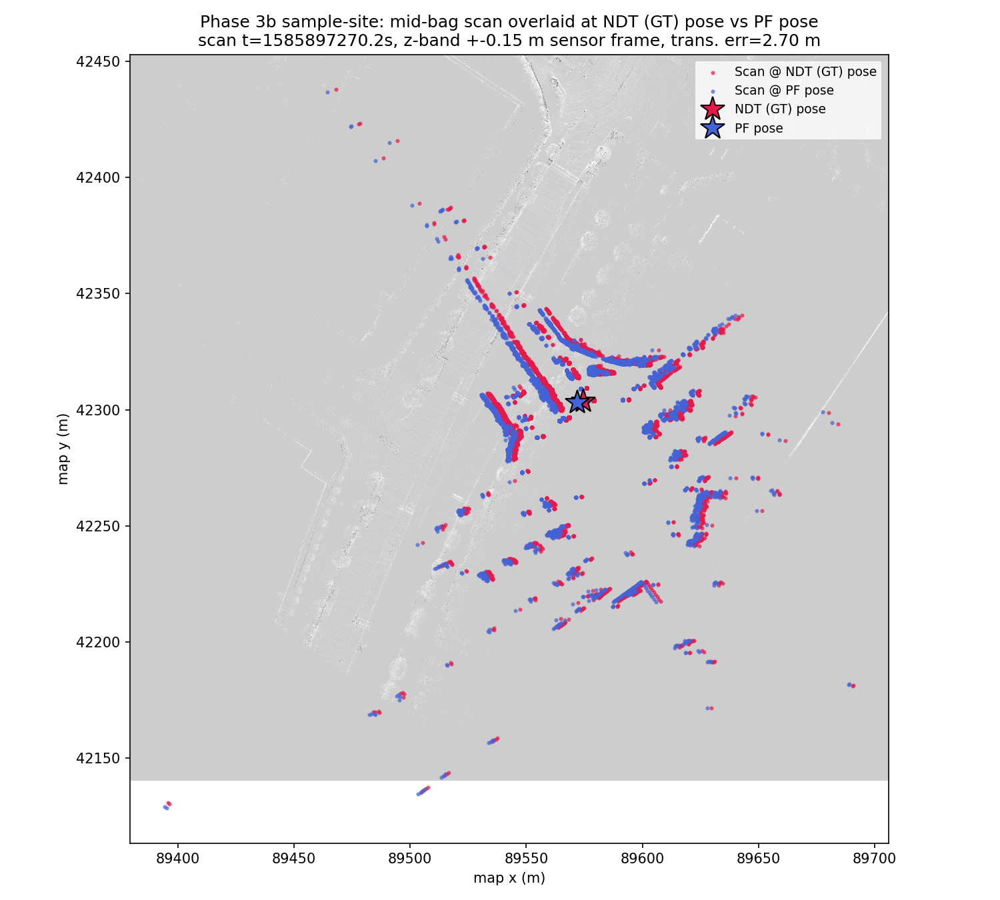

# Phase 3b: MCL (particle_filter) vs NDT Ground Truth Comparison — Sample Site

Statistics and thresholds below are auto-generated by
`scripts/2dlidar/compare_poses.py` (`--no-motion-window --gt-time-source bag`);
re-run the tool to refresh them. The Context, Scan Overlay, and Interpretation
sections are hand-written commentary specific to this rerun and are not
touched by re-running the tool.

- GT bag: `data/rosbags/phase3/sample_ndt_gt`
- PF bag: `data/rosbags/phase3/sample_pf_run`

## Context: why this is a rerun

This is a second Phase 3 MCL-vs-NDT comparison, run against Autoware's
official **sample map/rosbag** (the small urban site bundled with Autoware,
`sample-map-rosbag`) rather than the original COSS Park site. The COSS run
(`docs/reports/2dlidar-phase3-mcl-vs-ndt.md`) was demoted as a ground-truth
source after `docs/research/localization/ndt_parameter_tuning_coss_map.md`
found that NDT scan matching on the COSS map is untuned and misaligned —
i.e. the "ground truth" NDT track used as the comparison baseline is itself
unreliable there, which confounds any PF-vs-NDT comparison (a PF failure
mode and a GT failure mode are not distinguishable). The COSS PF-vs-NDT
result was **FAIL** (mean translational error 13.9 m, p95 24.7 m, yaw mean
0.695 rad), and the diagnostic note on that run observed the PF appeared
"stuck in an aliased basin" — plausibly consistent with a systematically
wrong NDT ground truth rather than (or in addition to) a genuine PF
localization failure. The sample site is Autoware's own reference urban
environment for NDT localization — dense structure, well-characterized,
NDT known to converge correctly there — so a PF-vs-NDT comparison against
it isolates PF's own accuracy without the COSS map's NDT-tuning confound.

## Overall Result: **FAIL**

## Full-Overlap Statistics

| Metric | Value |
|---|---|
| n (pairs) | 815 |
| Trans. mean (m) | 31.0085 |
| Trans. RMS (m) | 51.9234 |
| Trans. max (m) | 138.8153 |
| Trans. p95 (m) | 121.7424 |
| Yaw mean \|err\| (rad) | 0.9787 |
| Yaw max \|err\| (rad) | 3.1362 |

## Motion-Window Statistics

_Motion-window analysis disabled (`--no-motion-window`); this bag moves throughout the recording, so a fixed stationary/motion split is not meaningful here. Only full-overlap statistics are reported._

## Thresholds (applied to full-overlap stats)

| Threshold | Value | Limit | Result |
|---|---|---|---|
| Mean translational error < 1.0 m | 31.0085 | 1.0000 | FAIL |
| p95 translational error < 2.5 m | 121.7424 | 2.5000 | FAIL |
| Mean \|yaw\| error < 0.2 rad | 0.9787 | 0.2000 | FAIL |

## Notes

- Replay rate: 1.0x for both GT and PF recordings, replayed with `--clock` (sim time).
- GT time source: `--gt-time-source=bag` (rosbag2 storage receive-time, used because the GT bag was itself replayed to produce the PF run; see _read_bag() docstring in compare_poses.py for why header.stamp would give zero overlap here).
- PF params: `range_method=cddt`, particle count per vendored `config/localize.yaml` default (4000), `max_range=30.0` (outdoor VLP-32C), `scan_topic=/scan`, `odometry_topic=/odom`.
- Odometry input to PF was synthesized wheel+IMU planar unicycle integration (`scripts/2dlidar/wheel_imu_odom.py`), not a native wheel encoder feed — odometry quality directly affects PF motion-model accuracy between scans.
- GT is Autoware NDT `/localization/kinematic_state`; PF publishes pose in the occupancy-grid frame, which is sliced from the same PCD map as NDT's map frame — poses are directly comparable without a transform.
- Z-band caveat: comparison is 2D (x, y, yaw) only; the GT track's z is Autoware's 3D NDT estimate while PF is inherently 2D, so z is not compared.
- `/scan` was bridged from `/sensing/lidar/velodyne_points` via `pointcloud_to_laserscan` with a z-band filter (see Task 3); QoS was bridged from `pointcloud_to_laserscan`'s best-effort publisher to `particle_filter`'s reliable-QoS subscription.
- **Diagnostic note (not a fix):** the run above FAILs the Phase 3 gate. Full-overlap trans. mean=31.01 m, p95=121.74 m, yaw mean|err|=0.979 rad (thresholds: mean<1.0 m, p95<2.5 m, yaw<0.2 rad). Plausible contributors: (1) the synthesized wheel+IMU odometry feeding PF's motion model has no absolute correction and can accumulate heading error, which a particle filter with too few effective particles or a poor sensor model may fail to correct via scan matching; (2) `range_method=cddt` / particle count / sensor-model noise parameters were carried over from vendored defaults and may not be tuned for this scenario; (3) possible scan-to-map mismatches (z-band filter choice, `max_range`) reducing effective localization likelihood signal; (4) ground-truth quality itself (see report notes on the GT source) may be a contributing factor. PF parameter tuning is explicitly out of scope for this gate and is deferred to a Phase-3 follow-up.

## Scan Overlay

Mid-bag scan (`/sensing/lidar/top/pointcloud_raw_ex`, sensor-frame z-band
±0.15 m — the same band `pointcloud_to_laserscan` uses to build PF's
`/scan`) plotted transformed into map frame twice: once at the NDT (GT)
pose, once at the PF pose, both at their nearest-timestamp match to the
scan (dt ≤ 0.02 s both sides). Background is the scanplane occupancy grid
used for PF localization.

At this mid-bag instant the two scans trace the same structure (road edges,
building corners) closely — translational error here is only 2.70 m, well
under the full-run mean of 31.0 m. This is consistent with the pattern seen
in the raw error series (small near the start, growing to 130+ m by the
end of the ~28 s overlap window): the sample-site run is not a random or
constant-offset mismatch, it is a PF that starts tracking correctly and
then drifts, i.e. a genuine PF localization failure rather than an
artifact of ground-truth misalignment or map/frame setup — reinforcing
that (unlike the COSS run) this FAIL reflects PF accuracy itself, since
the sample-site NDT ground truth is not suspect the way the COSS NDT
track was.

## Interpretation

Both runs now FAIL the Phase 3 gate, but for materially different reasons:
COSS FAILed against a *demoted, untuned* NDT ground truth (mean 13.9 m,
PF apparently stuck in an aliased basin — plausibly a symptom of matching
against wrong "ground truth" as much as PF error). The sample-site run
FAILs against a *trustworthy* ground truth (mean 31.0 m, worse in absolute
terms) with a clear divergence signature: accurate at the start, growing
essentially unbounded. Removing the GT-quality confound did not turn this
into a PASS — if anything the sample site's shorter usable GT window
(~28 s of overlapping `/localization/kinematic_state` coverage inside a
~58 s PF run) gives the odometry-driven PF less time to be corrected by
scan matching before GT coverage ends, which may explain the larger
absolute numbers here relative to COSS's longer motion window. Taken
together, both runs point at the same root cause flagged as out-of-scope
for this gate: the synthesized wheel+IMU odometry motion model, PF
particle/sensor-model parameters (carried over from vendored defaults),
and the CPU-only `range_method=cddt` scan matcher are not tuned for either
site. PF parameter tuning remains the recommended next step, now on a
site where ground-truth quality is no longer a confound.
