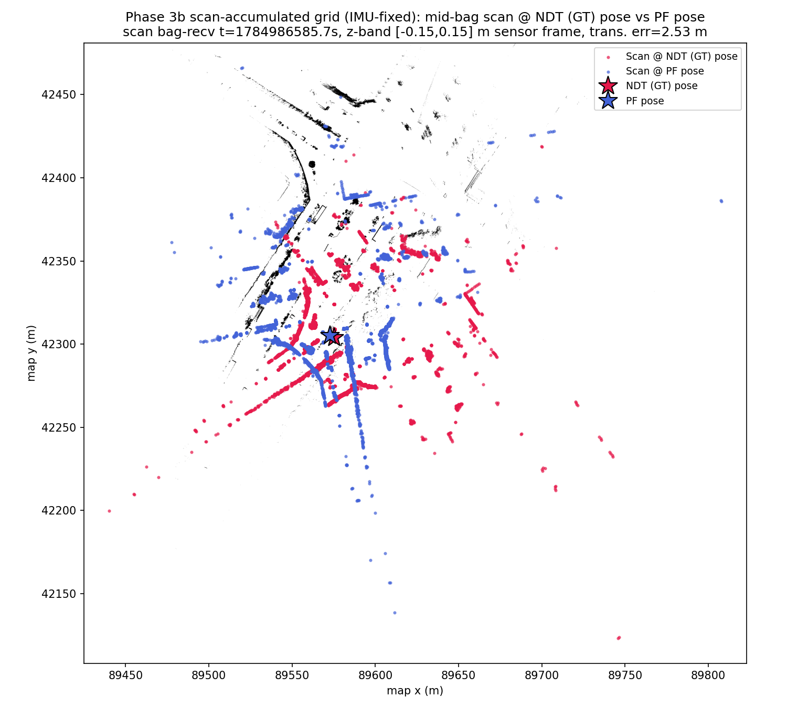

# Phase 3b: Scan-Accumulated Grid + IMU Yaw-Sign Fix — MCL vs NDT Ground Truth

Statistics/thresholds below are auto-generated by `compare_poses.py`
(`--no-motion-window --gt-time-source bag`); re-run to refresh. This
section and the Scan Overlay/Interpretation sections are hand-written and
not touched by re-running the tool.

- GT bag: `data/rosbags/phase3/sample_ndt_gt`
- PF bag: `data/rosbags/phase3/sample_pf_run_scanaccum_imufix`
- Map: `occupancy_grid_scanaccum.yaml` (same scan-accumulated grid as
  `2dlidar-phase3b-scanaccum.md`)
- Odometry fix: `IMU_YAW_SIGN=-1.0` — the Tamagawa IMU's
  `angular_velocity.z` is sign-inverted relative to map-frame yaw
  (z-down/NED-style mounting convention). Root-caused via dead-reckoning:
  GT total yaw over the 28s overlap was +1.486 rad vs raw-IMU-integrated
  -1.535 rad; negating omega drops dead-reckoning final error from 229.6 m
  to 4.05 m (mean 0.79 m). New `imu_yaw_sign` parameter on
  `wheel_imu_odom.py` (default 1.0, `-1.0` here), wired through
  `run-particle-filter.sh`'s `IMU_YAW_SIGN` env var.

## Overall Result: **FAIL**

## Full-Overlap Statistics

| Metric | Value |
|---|---|
| n (pairs) | 815 |
| Trans. mean (m) | 20.1634 |
| Trans. RMS (m) | 35.7547 |
| Trans. max (m) | 114.3149 |
| Trans. p95 (m) | 89.8093 |
| Yaw mean \|err\| (rad) | 1.3183 |
| Yaw max \|err\| (rad) | 3.1305 |

## Motion-Window Statistics

_Motion-window analysis disabled (`--no-motion-window`); this bag moves throughout the recording, so a fixed stationary/motion split is not meaningful here. Only full-overlap statistics are reported._

## Thresholds (applied to full-overlap stats)

| Threshold | Value | Limit | Result |
|---|---|---|---|
| Mean translational error < 1.0 m | 20.1634 | 1.0000 | FAIL |
| p95 translational error < 2.5 m | 89.8093 | 2.5000 | FAIL |
| Mean \|yaw\| error < 0.2 rad | 1.3183 | 0.2000 | FAIL |

## Notes

- Replay rate: 1.0x for both GT and PF recordings, replayed with `--clock` (sim time).
- GT time source: `--gt-time-source=bag` (rosbag2 storage receive-time, used because the GT bag was itself replayed to produce the PF run; see _read_bag() docstring in compare_poses.py for why header.stamp would give zero overlap here).
- PF params: `range_method=cddt`, particle count per vendored `config/localize.yaml` default (4000), `max_range=30.0` (outdoor VLP-32C), `scan_topic=/scan`, `odometry_topic=/odom`.
- Odometry input to PF was synthesized wheel+IMU planar unicycle integration (`scripts/2dlidar/wheel_imu_odom.py`), not a native wheel encoder feed — odometry quality directly affects PF motion-model accuracy between scans.
- GT is Autoware NDT `/localization/kinematic_state`; PF publishes pose in the occupancy-grid frame, which is sliced from the same PCD map as NDT's map frame — poses are directly comparable without a transform.
- Z-band caveat: comparison is 2D (x, y, yaw) only; the GT track's z is Autoware's 3D NDT estimate while PF is inherently 2D, so z is not compared.
- `/scan` was bridged from `/sensing/lidar/velodyne_points` via `pointcloud_to_laserscan` with a z-band filter (see Task 3); QoS was bridged from `pointcloud_to_laserscan`'s best-effort publisher to `particle_filter`'s reliable-QoS subscription.
- **Diagnostic note (not a fix):** the run above FAILs the Phase 3 gate. Full-overlap trans. mean=20.16 m, p95=89.81 m, yaw mean|err|=1.318 rad (thresholds: mean<1.0 m, p95<2.5 m, yaw<0.2 rad). Plausible contributors: (1) the synthesized wheel+IMU odometry feeding PF's motion model has no absolute correction and can accumulate heading error, which a particle filter with too few effective particles or a poor sensor model may fail to correct via scan matching; (2) `range_method=cddt` / particle count / sensor-model noise parameters were carried over from vendored defaults and may not be tuned for this scenario; (3) possible scan-to-map mismatches (z-band filter choice, `max_range`) reducing effective localization likelihood signal; (4) ground-truth quality itself (see report notes on the GT source) may be a contributing factor. PF parameter tuning is explicitly out of scope for this gate and is deferred to a Phase-3 follow-up.

## Scan Overlay

Mid-bag scan overlaid on the scan-accumulated grid at NDT (GT) pose vs PF
pose (same methodology as `2dlidar-phase3b-scanaccum.md`, static-TF-aware
projection, dt<=0.02s both sides).

## Interpretation

The IMU yaw-sign fix reduces error substantially on this map relative to
the pre-fix scan-accumulated run (`2dlidar-phase3b-scanaccum.md`): trans.
mean 25.25 m -> 20.16 m (-20%), p95 126.68 m -> 89.81 m (-29%), yaw
mean|err| 1.603 rad -> 1.318 rad (-18%) — the first run in this series
where all three metrics improve together rather than trading off. Still
FAILs the Phase 3 gate by a wide margin (thresholds mean<1.0 m, p95<2.5 m,
yaw<0.2 rad), so the odometry fix alone does not close the gate, but it is
a genuine, one-sided improvement — unlike the scan-accumulated grid change
alone (mean better, p95/yaw worse). See
`2dlidar-phase3b-scanplane-imufix.md` for the same odometry fix applied to
the original PCD-sliced grid, which isolates whether the remaining gap is
map-quality or PF-tuning driven.
