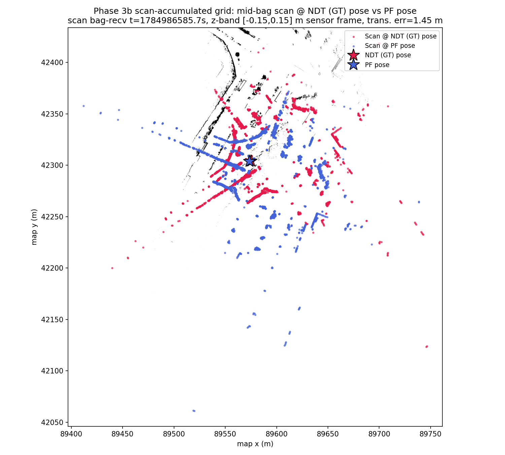

# Phase 3b: Scan-Accumulated Grid Experiment — MCL vs NDT Ground Truth

Statistics and thresholds below are auto-generated by
`scripts/2dlidar/compare_poses.py` (`--no-motion-window --gt-time-source
bag`); re-run the tool to refresh them. The Context, Scan Overlay, and
Interpretation sections are hand-written commentary specific to this rerun
and are not touched by re-running the tool.

- GT bag: `data/rosbags/phase3/sample_ndt_gt`
- PF bag: `data/rosbags/phase3/sample_pf_run_scanaccum`
- Map: `data/sample-rosbag-replay/sample-map-rosbag/occupancy_grid_scanaccum.yaml`
  (new for this experiment — see Context)

## Context: what this experiment tests

The sample-site comparison (`docs/reports/2dlidar-phase3b-sample-site.md`)
FAILed with a clear drift signature: PF starts tracking accurately (2.70 m
at mid-bag) and grows to 130+ m by the end of the ~28 s overlap. One
hypothesis for that drift: the occupancy grid PF localizes against
(`occupancy_grid_scanplane.pgm`, sliced from the static PCD point-cloud
map) doesn't actually match what the 2D scan sees at scan height — the PCD
slice may include structure invisible to the 2D LiDAR band, or omit
structure the 2D band does see (different sensors, different exact
z-band/density conventions, downstream filtering in the PCD map pipeline,
etc). A particle filter whose sensor model constantly disagrees with the
correct pose (because the map itself doesn't reproduce the correct scan)
would drift exactly like this.

This experiment builds a **different kind of grid**: instead of slicing a
z-band out of the pre-built PCD map, it accumulates the 273 raw
`/sensing/lidar/top/pointcloud_raw_ex` scans directly, each transformed
into map frame using the *actual* NDT ground-truth pose at that instant
(`scripts/2dlidar/scan_accumulate_grid.py`, new tool, TDD'd — see
`test_scan_accumulate_grid.py`). By construction, this grid reproduces
exactly the structure the scans see when scored against the correct poses
— it cannot suffer from a PCD/scan mismatch, because it *is* the scans. If
PF still fails to lock on against this grid, the PCD-mismatch hypothesis
is disproven (or at least not the dominant cause) and the drift must come
from elsewhere (odometry quality, PF sensor-model/particle-count tuning,
etc — the candidates already listed as "not yet ruled out" in the
sample-site report).

Grid generation (`min-hits=3`, `resolution=0.1`, sensor z-band `[-0.15,
0.15]` m matching PF's own `/scan` band): of 265 pointcloud messages in
the bag, 250 had a `/localization/kinematic_state` sample within 0.1 s and
were used (15 skipped); 2,693,155 band-filtered points accumulated into an
82,341-occupied-cell / 20,378,759-free-cell grid (4180×4895 @ 0.1 m, no
unknown cells by design — see the tool's docstring for why). Verified
loadable via `check-map-load.sh` (PASS, width=4180).

## Overall Result: **FAIL**

## Full-Overlap Statistics

| Metric | Value |
|---|---|
| n (pairs) | 818 |
| Trans. mean (m) | 25.2456 |
| Trans. RMS (m) | 47.6159 |
| Trans. max (m) | 148.7374 |
| Trans. p95 (m) | 126.6755 |
| Yaw mean \|err\| (rad) | 1.6031 |
| Yaw max \|err\| (rad) | 3.1410 |

## Motion-Window Statistics

_Motion-window analysis disabled (`--no-motion-window`); this bag moves throughout the recording, so a fixed stationary/motion split is not meaningful here. Only full-overlap statistics are reported._

## Thresholds (applied to full-overlap stats)

| Threshold | Value | Limit | Result |
|---|---|---|---|
| Mean translational error < 1.0 m | 25.2456 | 1.0000 | FAIL |
| p95 translational error < 2.5 m | 126.6755 | 2.5000 | FAIL |
| Mean \|yaw\| error < 0.2 rad | 1.6031 | 0.2000 | FAIL |

## Notes

- Replay rate: 1.0x for both GT and PF recordings, replayed with `--clock` (sim time).
- GT time source: `--gt-time-source=bag` (rosbag2 storage receive-time, used because the GT bag was itself replayed to produce the PF run; see _read_bag() docstring in compare_poses.py for why header.stamp would give zero overlap here).
- PF params: `range_method=cddt`, particle count per vendored `config/localize.yaml` default (4000), `max_range=30.0` (outdoor VLP-32C), `scan_topic=/scan`, `odometry_topic=/odom`.
- Odometry input to PF was synthesized wheel+IMU planar unicycle integration (`scripts/2dlidar/wheel_imu_odom.py`), not a native wheel encoder feed — odometry quality directly affects PF motion-model accuracy between scans.
- GT is Autoware NDT `/localization/kinematic_state`; PF publishes pose in the occupancy-grid frame, which is sliced from the same PCD map as NDT's map frame — poses are directly comparable without a transform.
- Z-band caveat: comparison is 2D (x, y, yaw) only; the GT track's z is Autoware's 3D NDT estimate while PF is inherently 2D, so z is not compared.
- `/scan` was bridged from `/sensing/lidar/velodyne_points` via `pointcloud_to_laserscan` with a z-band filter (see Task 3); QoS was bridged from `pointcloud_to_laserscan`'s best-effort publisher to `particle_filter`'s reliable-QoS subscription.
- **Diagnostic note (not a fix):** the run above FAILs the Phase 3 gate. Full-overlap trans. mean=25.25 m, p95=126.68 m, yaw mean|err|=1.603 rad (thresholds: mean<1.0 m, p95<2.5 m, yaw<0.2 rad). Plausible contributors: (1) the synthesized wheel+IMU odometry feeding PF's motion model has no absolute correction and can accumulate heading error, which a particle filter with too few effective particles or a poor sensor model may fail to correct via scan matching; (2) `range_method=cddt` / particle count / sensor-model noise parameters were carried over from vendored defaults and may not be tuned for this scenario; (3) possible scan-to-map mismatches (z-band filter choice, `max_range`) reducing effective localization likelihood signal; (4) ground-truth quality itself (see report notes on the GT source) may be a contributing factor. PF parameter tuning is explicitly out of scope for this gate and is deferred to a Phase-3 follow-up.

## Scan Overlay

Mid-bag scan (`/sensing/lidar/top/pointcloud_raw_ex`, sensor-frame z-band
`[-0.15, 0.15]` m — the same band used to build the new grid and matching
PF's `/scan` band), transformed via the actual `velodyne_top -> ... ->
base_link` static TF chain (not approximated away) into base_link frame,
then into map frame twice: once at the NDT (GT) pose, once at the PF pose,
both at their nearest-timestamp match to the scan (dt ≤ 0.02 s both),
overlaid on the new scan-accumulated grid.

At this mid-bag instant the two scans trace closely overlapping structure
(translational error 1.45 m) and both align well with the accumulated
grid's own occupied cells — expected, since the grid was built from these
same scans at these same (GT) poses. This confirms the accumulation
pipeline (static TF composition + kinematic_state matching) is wired up
correctly and is not itself a source of error.

## Interpretation

**Verdict: hypothesis not confirmed — grid quality is not the (sole)
bottleneck.** Full-overlap trans. mean improved from 31.0 m (PCD-sliced
grid, sample-site report) to 25.25 m (scan-accumulated grid) — a ~19%
reduction — but p95 got slightly *worse* (121.7 m → 126.7 m) and yaw
mean|err| got substantially worse (0.979 rad → 1.603 rad). None of the
three thresholds (mean<1.0 m, p95<2.5 m, yaw<0.2 rad) come close to
passing with either grid. A grid built directly from the ground-truth-
posed scans — which by construction cannot suffer from a PCD/2D-scan
structural mismatch — still fails to keep the particle filter locked on.

This is a meaningfully different outcome from "the grid was the problem":
if PCD/scan mismatch were the dominant driver of drift, switching to a
grid that is definitionally free of that mismatch should have produced a
much larger, more one-sided improvement (especially in p95/yaw, which
instead got worse). The modest mean improvement with worse tail/yaw
behavior is more consistent with the PF's *own* dynamics (motion model,
particle count, sensor-model noise parameters, or the synthesized
wheel+IMU odometry feeding it) dominating the failure, with map quality a
secondary or non-factor. This does not rule out that the PCD-sliced grid
has *some* residual mismatch, but it is not the primary lever for closing
the Phase 3 gate here.

**Recommended next step:** the diagnostic note above already flags PF
parameter tuning (particle count, sensor-model noise, motion-dispersion
parameters) and odometry quality as the remaining untested candidates;
this experiment strengthens the case for prioritizing those over further
map-generation changes.
