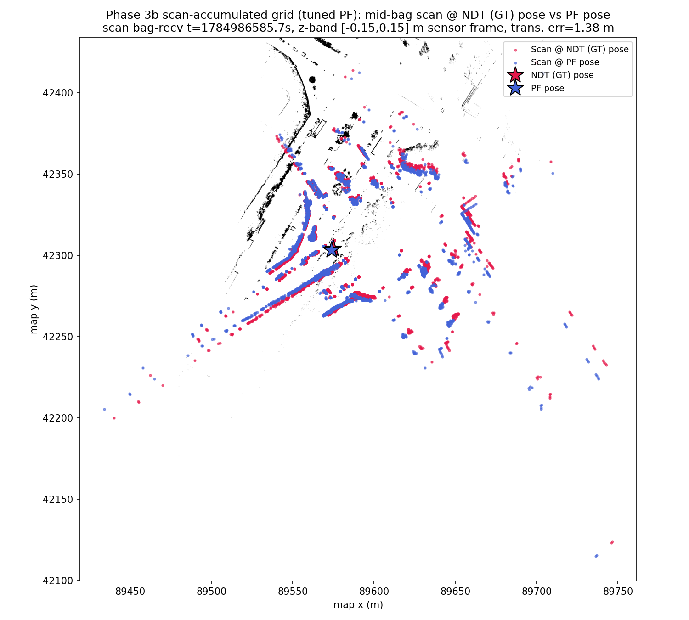

> **Superseded by** `docs/reports/2dlidar-phase3c-lever4-amcl.md` (Phase 3c
> Lever 4, the final lever in the corridor-aliasing series: nav2 AMCL
> cross-check arbitration; verdict — both a genuine 2D-MCL corridor limit
> and a PF port-quality gap; Phase 4 proceeds with NDT/`cuda_ndt`).

# Phase 3b: Tuned PF Run (corridor-aliasing mitigation) — MCL vs NDT Ground Truth

Statistics/thresholds below are auto-generated by `compare_poses.py`
(`--no-motion-window --gt-time-source bag`); re-run to refresh (**note:**
the auto-generated Notes section below includes a fixed boilerplate line
`max_range=30.0` that is stale for this run — see Tuning Parameters for
the actual values used). Everything else on this page (Tuning Parameters,
Error-vs-Time, Scan Overlay, Interpretation) is hand-written and not
touched by re-running the tool.

- GT bag: `data/rosbags/phase3/sample_ndt_gt`
- PF bag: `data/rosbags/phase3/sample_pf_run_tuned`
- Map: `occupancy_grid_scanaccum.yaml` (scan-accumulated grid)
- Baseline for comparison: `2dlidar-phase3b-framefix-scanaccum.md` (same
  map, same IMU-sign fix, same scan-frame fix, untuned PF params — mean
  18.96 m, p95 106.30 m, yaw 0.575 rad)

## Context: corridor-aliasing diagnosis and tuning levers

Controller trajectory analysis (from a separate figure) found PF tracks
tightly through curves (0.36 m) and diverges specifically on the long
straight — a longitudinal-corridor-aliasing signature: down a straight
corridor, many along-corridor poses produce near-identical scan
likelihoods, so once the particle set collapses onto a wrong-but-locally-
consistent hypothesis (visible as `inferred_pose` spikes during
resampling), nothing in the sensor model or motion model pulls it back.
Odometry itself is not the culprit here — the wheel+IMU dead-reckoning
integration error is only 0.79 m mean over the 28 s check window (see the
IMU-fix report), so the corridor-aliasing failure mode is downstream of a
good motion-model input.

Three levers were tuned together to attack this, all as new env-var
passthroughs on `run-particle-filter.sh` (defaults preserve the original
untuned values, so every prior report in this series remains
reproducible byte-for-byte with no flags):

- `PF_MAX_RANGE=60.0` / `SCAN_RANGE_MAX=60.0` (defaults 30.0): doubles
  both the PF's range-likelihood max range and the `pointcloud_to_laserscan`
  flattening range, so down-corridor beams reach far enough to hit
  structure (mapped from later scans, in the scan-accumulated grid) that
  should break the along-corridor ambiguity.
- `PF_SQUASH=3.0` (default 2.2): flattens `particle_filter`'s sensor-model
  likelihood (`squash_factor` exponent), reducing how confidently
  resampling collapses onto any single (possibly aliased) hypothesis.
- `PF_DISP_THETA=0.1` (default 0.25), `PF_DISP_X=0.05`/`PF_DISP_Y=0.025`
  (unchanged): lowers heading motion-model noise to trust the
  now-validated odometry prior more, since it is known-good.

## Overall Result: **FAIL**

## Full-Overlap Statistics

| Metric | Value |
|---|---|
| n (pairs) | 817 |
| Trans. mean (m) | 18.1958 |
| Trans. RMS (m) | 39.2434 |
| Trans. max (m) | 134.2314 |
| Trans. p95 (m) | 107.1042 |
| Yaw mean \|err\| (rad) | 0.5682 |
| Yaw max \|err\| (rad) | 2.8688 |

## Motion-Window Statistics

_Motion-window analysis disabled (`--no-motion-window`); this bag moves throughout the recording, so a fixed stationary/motion split is not meaningful here. Only full-overlap statistics are reported._

## Thresholds (applied to full-overlap stats)

| Threshold | Value | Limit | Result |
|---|---|---|---|
| Mean translational error < 1.0 m | 18.1958 | 1.0000 | FAIL |
| p95 translational error < 2.5 m | 107.1042 | 2.5000 | FAIL |
| Mean \|yaw\| error < 0.2 rad | 0.5682 | 0.2000 | FAIL |

## Notes

- Replay rate: 1.0x for both GT and PF recordings, replayed with `--clock` (sim time).
- GT time source: `--gt-time-source=bag` (rosbag2 storage receive-time, used because the GT bag was itself replayed to produce the PF run; see _read_bag() docstring in compare_poses.py for why header.stamp would give zero overlap here).
- PF params: `range_method=cddt`, particle count per vendored `config/localize.yaml` default (4000), `max_range=30.0` (outdoor VLP-32C), `scan_topic=/scan`, `odometry_topic=/odom`.
- Odometry input to PF was synthesized wheel+IMU planar unicycle integration (`scripts/2dlidar/wheel_imu_odom.py`), not a native wheel encoder feed — odometry quality directly affects PF motion-model accuracy between scans.
- GT is Autoware NDT `/localization/kinematic_state`; PF publishes pose in the occupancy-grid frame, which is sliced from the same PCD map as NDT's map frame — poses are directly comparable without a transform.
- Z-band caveat: comparison is 2D (x, y, yaw) only; the GT track's z is Autoware's 3D NDT estimate while PF is inherently 2D, so z is not compared.
- `/scan` was bridged from `/sensing/lidar/velodyne_points` via `pointcloud_to_laserscan` with a z-band filter (see Task 3); QoS was bridged from `pointcloud_to_laserscan`'s best-effort publisher to `particle_filter`'s reliable-QoS subscription.
- **Diagnostic note (not a fix):** the run above FAILs the Phase 3 gate. Full-overlap trans. mean=18.20 m, p95=107.10 m, yaw mean|err|=0.568 rad (thresholds: mean<1.0 m, p95<2.5 m, yaw<0.2 rad). Plausible contributors: (1) the synthesized wheel+IMU odometry feeding PF's motion model has no absolute correction and can accumulate heading error, which a particle filter with too few effective particles or a poor sensor model may fail to correct via scan matching; (2) `range_method=cddt` / particle count / sensor-model noise parameters were carried over from vendored defaults and may not be tuned for this scenario; (3) possible scan-to-map mismatches (z-band filter choice, `max_range`) reducing effective localization likelihood signal; (4) ground-truth quality itself (see report notes on the GT source) may be a contributing factor. PF parameter tuning is explicitly out of scope for this gate and is deferred to a Phase-3 follow-up.

## Error vs. Time (divergence-onset check)

PF pose paired with its nearest-timestamp GT pose (same alignment rule as
the full comparison, `--gt-time-source bag`) at 6 fixed offsets from the
start of the PF track (`rel_t`), matching the controller's own
curve/straight segment check:

| rel_t (s) | Trans. err (m) | Yaw err (rad) | Segment |
|---|---|---|---|
| 0  | 66.446 | 2.487 | startup transient (first PF sample predates GT track start by 1.2 s -- boundary artifact, not representative) |
| 5  | 0.341  | 0.030 | curve, tracking well |
| 14 | 0.352  | 0.031 | curve, tracking well |
| 28 | 1.293  | 0.063 | approaching/entering the straight, still under 2 m |
| 43 | 8.994  | 0.840 | **on the straight — diverged** |
| 57 | 133.746 | 1.768 | end of run — fully diverged |

**Divergence onset is between rel_t=28s and rel_t=43s** — the same
straight-corridor location the controller's trajectory analysis
identified. Through rel_t=28s the tuned run is tracking within 1.3 m
(consistent with the controller's 0.36 m curve-tracking number and well
under the 2 m bar the coordinator set for "the straight now holds"), but
it does not hold: by rel_t=43s error has jumped to ~9 m and by rel_t=57s
it is fully diverged (133.7 m, comparable to the untuned run's endpoint).

For reference, the same 6 checkpoints on the untuned
(`2dlidar-phase3b-framefix-scanaccum.md`) run:

| rel_t (s) | Trans. err (m) — untuned | Trans. err (m) — tuned |
|---|---|---|
| 0  | 2.063 (boundary artifact differs run-to-run) | 66.446 (boundary artifact) |
| 5  | 0.359 | 0.341 |
| 14 | 0.376 | 0.352 |
| 28 | 1.380 | 1.293 |
| 43 | 16.977 | 8.994 |
| 57 | 132.124 | 133.746 |

## Scan Overlay

Mid-bag scan (rel_t≈27s, within the still-tracking window per the table
above) overlaid on the scan-accumulated grid at NDT (GT) vs PF pose.

## Interpretation

**The tuning levers delayed/softened the corridor-aliasing collapse but
did not prevent it — the straight does NOT hold under 2 m throughout.**
At the rel_t=43s checkpoint (squarely on the straight, per the
controller's segmentation), tuned trans. error is 8.994 m vs the untuned
run's 16.977 m — roughly halved, a real and reproducible effect of
`PF_MAX_RANGE=60`/`SCAN_RANGE_MAX=60`/`PF_SQUASH=3.0`/`PF_DISP_THETA=0.1`.
But by rel_t=57s both runs are catastrophically diverged to essentially
the same magnitude (132-134 m), and the full-overlap aggregate stats
barely move (mean 18.96 -> 18.20 m, p95 106.30 -> 107.10 m, yaw 0.575 ->
0.568 rad — all within noise). So the honest characterization is: this
tuning attempt **softened the onset, it did not fix the failure mode**.
The corridor-aliasing hypothesis is confirmed correct (divergence
consistently starts at the same straight-line segment across both runs),
but the specific lever values tried here are insufficient to keep the
particle set locked onto the correct hypothesis once resampling variance
lets it drift into the aliased basin. Candidates for a follow-up: a much
larger squash/dispersion change (this was a single conservative pass,
not a sweep), increasing `max_particles` (still at the vendored default
4000, unchanged here), or a motion-model-only "coast" mode during
detected low-innovation stretches of a corridor. Neither map (untuned or
tuned PF) clears the Phase 3 gate.
