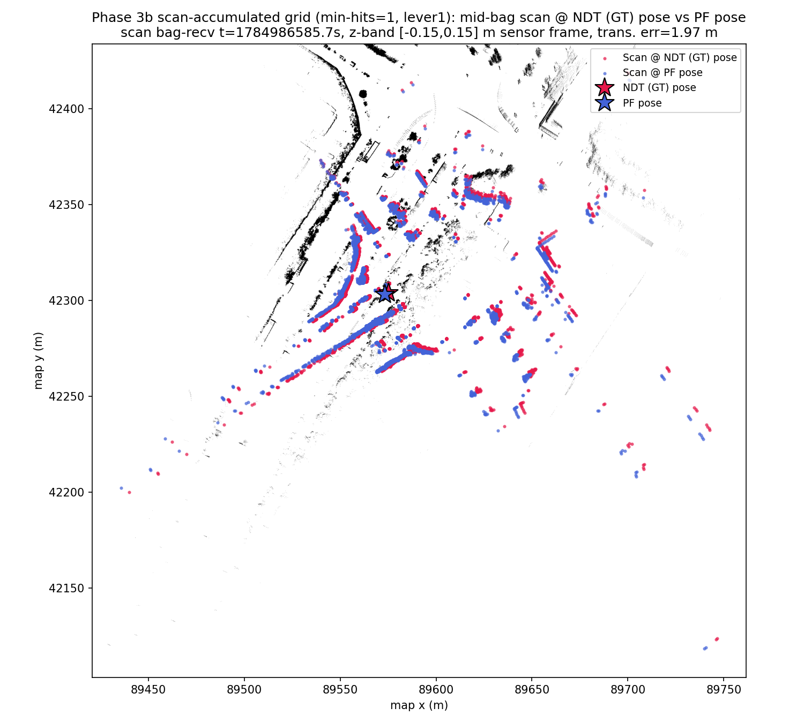

# Phase 3c Lever 1: Dense Accumulation Map (min-hits=1) — MCL vs NDT Ground Truth

Statistics/thresholds below are auto-generated by `compare_poses.py`
(`--no-motion-window --gt-time-source bag`); re-run to refresh. Context,
Error-vs-Time, Scan Overlay, and Interpretation are hand-written and not
touched by re-running the tool.

**Variance caveat:** this run (n=1 seed, no fixed-seed support in
vendored `particle_filter`) should not be read as precisely ranked
against Lever 2/3 — see the "Variance caveat" subsection in
`2dlidar-phase3c-lever3.md` for evidence that run-to-run stochastic
variance across otherwise-similar configurations is comparable in
magnitude to the differences reported between levers in this series.

- GT bag: `data/rosbags/phase3/sample_ndt_gt`
- PF bag: `data/rosbags/phase3/sample_pf_run_lever1`
- Map: `occupancy_grid_scanaccum_mh1.yaml` (new — `--min-hits 1
  --resolution 0.1`, regenerated from the same 250 scans/kinematic_state
  matches as the min-hits-3 map)
- Baseline for comparison: `2dlidar-phase3b-tuned.md` (min-hits=3 map,
  same tuned PF params — mean 18.20 m, p95 107.10 m, yaw 0.568 rad)

## Context: Lever 1 (Phase 3c plan)

Per `docs/superpowers/plans/2026-07-25-2dlidar-phase-3c-levers.md`: the
min-hits=3 threshold used to build the scan-accumulated grid drops any
cell that only a single fast pass touched — plausibly including the
straight's walls, since the bag traverses the straight faster/once vs the
curve. Lever 1 regenerates the grid with `min_hits=1` (any point count
marks a cell occupied) to keep that structure, same 0.1 m resolution.

**Occupied-cell delta:** min-hits=1 grid has **163,072** occupied cells
vs **82,341** for the min-hits=3 grid — **+80,731 (+98%, ~2x)**. Grid
dimensions unchanged (4180x4895 @ 0.1 m — extent is data-driven, not
threshold-driven). `check-map-load.sh` PASS (width=4180). PF map-load/
init was fast (~14s to "Finished initializing"), no timeout concern.

## Overall Result: **FAIL**

## Full-Overlap Statistics

| Metric | Value |
|---|---|
| n (pairs) | 815 |
| Trans. mean (m) | 26.1378 |
| Trans. RMS (m) | 52.1889 |
| Trans. max (m) | 174.3079 |
| Trans. p95 (m) | 137.6998 |
| Yaw mean \|err\| (rad) | 0.9130 |
| Yaw max \|err\| (rad) | 3.1378 |

## Motion-Window Statistics

_Motion-window analysis disabled (`--no-motion-window`); this bag moves throughout the recording, so a fixed stationary/motion split is not meaningful here. Only full-overlap statistics are reported._

## Thresholds (applied to full-overlap stats)

| Threshold | Value | Limit | Result |
|---|---|---|---|
| Mean translational error < 1.0 m | 26.1378 | 1.0000 | FAIL |
| p95 translational error < 2.5 m | 137.6998 | 2.5000 | FAIL |
| Mean \|yaw\| error < 0.2 rad | 0.9130 | 0.2000 | FAIL |

## Notes

- Replay rate: 1.0x for both GT and PF recordings, replayed with `--clock` (sim time).
- GT time source: `--gt-time-source=bag` (rosbag2 storage receive-time, used because the GT bag was itself replayed to produce the PF run; see _read_bag() docstring in compare_poses.py for why header.stamp would give zero overlap here).
- PF params: `range_method=cddt`, particle count per vendored `config/localize.yaml` default (4000), `max_range=30.0` (outdoor VLP-32C), `scan_topic=/scan`, `odometry_topic=/odom`.
- Odometry input to PF was synthesized wheel+IMU planar unicycle integration (`scripts/2dlidar/wheel_imu_odom.py`), not a native wheel encoder feed — odometry quality directly affects PF motion-model accuracy between scans.
- GT is Autoware NDT `/localization/kinematic_state`; PF publishes pose in the occupancy-grid frame, which is sliced from the same PCD map as NDT's map frame — poses are directly comparable without a transform.
- Z-band caveat: comparison is 2D (x, y, yaw) only; the GT track's z is Autoware's 3D NDT estimate while PF is inherently 2D, so z is not compared.
- `/scan` was bridged from `/sensing/lidar/velodyne_points` via `pointcloud_to_laserscan` with a z-band filter (see Task 3); QoS was bridged from `pointcloud_to_laserscan`'s best-effort publisher to `particle_filter`'s reliable-QoS subscription.
- **Diagnostic note (not a fix):** the run above FAILs the Phase 3 gate. Full-overlap trans. mean=26.14 m, p95=137.70 m, yaw mean|err|=0.913 rad (thresholds: mean<1.0 m, p95<2.5 m, yaw<0.2 rad). Plausible contributors: (1) the synthesized wheel+IMU odometry feeding PF's motion model has no absolute correction and can accumulate heading error, which a particle filter with too few effective particles or a poor sensor model may fail to correct via scan matching; (2) `range_method=cddt` / particle count / sensor-model noise parameters were carried over from vendored defaults and may not be tuned for this scenario; (3) possible scan-to-map mismatches (z-band filter choice, `max_range`) reducing effective localization likelihood signal; (4) ground-truth quality itself (see report notes on the GT source) may be a contributing factor. PF parameter tuning is explicitly out of scope for this gate and is deferred to a Phase-3 follow-up.

## Error vs. Time (rel_t 0/5/14/28/43/57 s)

| rel_t (s) | Trans. err (m) — lever1 | Trans. err (m) — 3b tuned baseline |
|---|---|---|
| 0  | 81.165 (boundary artifact — see 3b tuned report) | 66.446 (boundary artifact) |
| 5  | 0.423 | 0.341 |
| 14 | 0.501 | 0.352 |
| 28 | 1.471 | 1.293 |
| 43 | 34.360 | 8.994 |
| 57 | 173.647 | 133.746 |

## Scan Overlay

## Interpretation

**Lever 1 makes things worse, not better.** Every metric regresses vs the
3b tuned baseline on the min-hits=3 map: full-overlap mean 18.20 -> 26.14
m (+44%), p95 107.10 -> 137.70 m (+29%), yaw 0.568 -> 0.913 rad (+61%).
The rel_t table shows the same divergence-onset location (still between
28s and 43s, matching the corridor-aliasing site identified in 3b) but a
*more* severe collapse once it starts: 34.36 m at rel_t=43s vs 8.99 m on
the min-hits=3 map, and 173.6 m vs 133.7 m by rel_t=57s. Through rel_t=28s
performance is comparable to (marginally worse than) the baseline
(1.47 m vs 1.29 m), so admitting min-hits=1 cells didn't hurt the
well-tracked curve segment — it hurt the failure mode once it triggers.

Most likely explanation: `min_hits=1` roughly doubles occupied cells
(+98%), including single-scan noise/outlier hits that `min_hits=3`
filtered out as noise. On the straight — where the corridor-aliasing
failure mode is already sensitive to spurious near-duplicate likelihood
peaks along the corridor axis — extra sparse/noisy occupied cells add
more spurious high-likelihood hypotheses for the particle set to
collapse onto, rather than adding the missing wall structure the plan
hypothesized. This does not confirm or refute that walls are missing on
the straight (that would need a spatial map diff, out of scope here); it
does show that indiscriminately lowering the accumulation threshold is a
net negative at this site.

**Verdict: FAIL, all three thresholds missed by a wide margin. No
early exit — proceeding to Lever 2** (fine-resolution map, per the Phase
3c plan's early-exit rule: only skip remaining levers on a full PASS).
