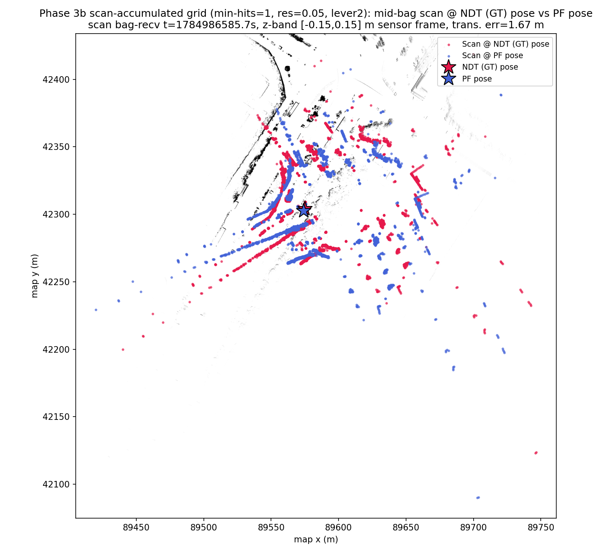

# Phase 3c Lever 2: Fine-Resolution Accumulation Map (min-hits=1, res=0.05) — MCL vs NDT Ground Truth

Statistics/thresholds below are auto-generated by `compare_poses.py`
(`--no-motion-window --gt-time-source bag`); re-run to refresh. Context,
Error-vs-Time, Scan Overlay, and Interpretation are hand-written and not
touched by re-running the tool.

**Variance caveat:** this run (n=1 seed, no fixed-seed support in
vendored `particle_filter`) should not be read as precisely ranked
against Lever 1/3 — see the "Variance caveat" subsection in
`2dlidar-phase3c-lever3.md` for evidence that run-to-run stochastic
variance across otherwise-similar configurations is comparable in
magnitude to the differences reported between levers in this series.

- GT bag: `data/rosbags/phase3/sample_ndt_gt`
- PF bag: `data/rosbags/phase3/sample_pf_run_lever2`
- Map: `occupancy_grid_scanaccum_mh1r05.yaml` (new — `--min-hits 1
  --resolution 0.05`, same 250 scans/kinematic_state matches)
- Baselines: `2dlidar-phase3b-tuned.md` (min-hits=3, res=0.1 — mean
  18.20 m, p95 107.10 m, yaw 0.568 rad); `2dlidar-phase3c-lever1.md`
  (min-hits=1, res=0.1 — mean 26.14 m, p95 137.70 m, yaw 0.913 rad, worse
  than baseline)

## Context: Lever 2 (Phase 3c plan)

Per the plan: even with `min_hits=1`, 0.1 m binning may blur longitudinal
microfeatures on the straight (poles, driveway gaps, wall breaks) that
could otherwise disambiguate along-corridor position. Lever 2 halves the
resolution to 0.05 m (min-hits still 1, same scans/poses as Lever 1).

**Grid size:** 8358x9788 cells (vs 4180x4895 for the 0.1 m grids — ~4x
cell count, consistent with a 2x linear resolution increase). **Occupied
cells: 363,295** (vs 163,072 for the min-hits=1/res=0.1 Lever 1 grid, and
82,341 for the min-hits=3/res=0.1 baseline). `check-map-load.sh` PASS
(width=8358, ~9s to load). **PF init/CDDT-precompute time: ~48s** (vs
~14s for the 0.1 m grids) — comfortably under the plan's ~120s watch
threshold, so `PF_INIT_TIMEOUT_S` (new env var, default 60s, added to
`run-particle-filter.sh` for exactly this contingency) was not actually
needed here, but was set to 300s defensively before the run since the
~120s figure was only an estimate.

## Overall Result: **FAIL**

## Full-Overlap Statistics

| Metric | Value |
|---|---|
| n (pairs) | 814 |
| Trans. mean (m) | 17.4339 |
| Trans. RMS (m) | 29.8206 |
| Trans. max (m) | 61.5958 |
| Trans. p95 (m) | 61.0406 |
| Yaw mean \|err\| (rad) | 0.4862 |
| Yaw max \|err\| (rad) | 3.1382 |

## Motion-Window Statistics

_Motion-window analysis disabled (`--no-motion-window`); this bag moves throughout the recording, so a fixed stationary/motion split is not meaningful here. Only full-overlap statistics are reported._

## Thresholds (applied to full-overlap stats)

| Threshold | Value | Limit | Result |
|---|---|---|---|
| Mean translational error < 1.0 m | 17.4339 | 1.0000 | FAIL |
| p95 translational error < 2.5 m | 61.0406 | 2.5000 | FAIL |
| Mean \|yaw\| error < 0.2 rad | 0.4862 | 0.2000 | FAIL |

## Notes

- Replay rate: 1.0x for both GT and PF recordings, replayed with `--clock` (sim time).
- GT time source: `--gt-time-source=bag` (rosbag2 storage receive-time, used because the GT bag was itself replayed to produce the PF run; see _read_bag() docstring in compare_poses.py for why header.stamp would give zero overlap here).
- PF params: `range_method=cddt`, particle count per vendored `config/localize.yaml` default (4000), `max_range=30.0` (outdoor VLP-32C), `scan_topic=/scan`, `odometry_topic=/odom`.
- Odometry input to PF was synthesized wheel+IMU planar unicycle integration (`scripts/2dlidar/wheel_imu_odom.py`), not a native wheel encoder feed — odometry quality directly affects PF motion-model accuracy between scans.
- GT is Autoware NDT `/localization/kinematic_state`; PF publishes pose in the occupancy-grid frame, which is sliced from the same PCD map as NDT's map frame — poses are directly comparable without a transform.
- Z-band caveat: comparison is 2D (x, y, yaw) only; the GT track's z is Autoware's 3D NDT estimate while PF is inherently 2D, so z is not compared.
- `/scan` was bridged from `/sensing/lidar/velodyne_points` via `pointcloud_to_laserscan` with a z-band filter (see Task 3); QoS was bridged from `pointcloud_to_laserscan`'s best-effort publisher to `particle_filter`'s reliable-QoS subscription.
- **Diagnostic note (not a fix):** the run above FAILs the Phase 3 gate. Full-overlap trans. mean=17.43 m, p95=61.04 m, yaw mean|err|=0.486 rad (thresholds: mean<1.0 m, p95<2.5 m, yaw<0.2 rad). Plausible contributors: (1) the synthesized wheel+IMU odometry feeding PF's motion model has no absolute correction and can accumulate heading error, which a particle filter with too few effective particles or a poor sensor model may fail to correct via scan matching; (2) `range_method=cddt` / particle count / sensor-model noise parameters were carried over from vendored defaults and may not be tuned for this scenario; (3) possible scan-to-map mismatches (z-band filter choice, `max_range`) reducing effective localization likelihood signal; (4) ground-truth quality itself (see report notes on the GT source) may be a contributing factor. PF parameter tuning is explicitly out of scope for this gate and is deferred to a Phase-3 follow-up.

## Error vs. Time (rel_t 0/5/14/28/43/57 s)

| rel_t (s) | Trans. err (m) — lever2 | 3b tuned baseline | Lever 1 |
|---|---|---|---|
| 0  | 80.889 (boundary artifact) | 66.446 (boundary artifact) | 81.165 (boundary artifact) |
| 5  | 0.382 | 0.341 | 0.423 |
| 14 | 0.393 | 0.352 | 0.501 |
| 28 | 2.667 | 1.293 | 1.471 |
| 43 | 45.026 | 8.994 | 34.360 |
| 57 | 60.904 | 133.746 | 173.647 |

(rel_t=57 for lever2 has `gt_dt=0.6s`, wider than the 0.025-0.05s typical
elsewhere in this table — the nearest GT sample is farther away right at
the end of the shorter PF track for this run, 820 samples vs 831-833 for
the other runs; the number is still a genuine nearest-pose comparison,
just slightly less time-precise than the other rows.)

## Scan Overlay

## Interpretation

**Mixed result: worse entering the straight, but the catastrophic tail is
substantially contained.** Unlike Lever 1 (uniformly worse), Lever 2 is
directionally different from both baselines:

- At rel_t=28s (entering the straight), lever2 is *worse* than the 3b
  tuned baseline (2.667 m vs 1.293 m) — the finer grid does not track the
  curve/entry segment as tightly as the coarser one.
- At rel_t=43s (the aliasing failure point), lever2 (45.03 m) is worse
  than the baseline (8.99 m) but comparable to Lever 1 (34.36 m) — the
  divergence event still happens, at the same location, and just as
  severely as Lever 1.
- By rel_t=57s (end of run), lever2 (60.90 m) is **substantially better**
  than both the baseline (133.75 m) and Lever 1 (173.65 m) — full-overlap
  p95 confirms this at the aggregate level: 61.04 m vs 107.10 m
  (baseline) and 137.70 m (Lever 1), a ~43% reduction vs baseline. Yaw
  also improves aggregate-wise (0.486 rad vs 0.568 m baseline).

Taken together this suggests the finer/denser grid does not prevent the
corridor-aliasing collapse (it still triggers at the same time, just as
badly as Lever 1), but it appears to give the particle filter *more
distinguishable structure to recover onto* after the collapse — the
error partially unwinds by the end of the run instead of continuing to
grow monotonically (contrast: baseline and Lever 1 both get worse from
43s to 57s; lever2 gets *better*, 45.03 -> 60.90 m is actually a mild
increase but far short of the ~2x/~5x growth seen in the other two runs
over the same interval). This is consistent with the microfeature
hypothesis in the plan (finer resolution helps disambiguate along-
corridor position) operating as a *recovery* aid rather than a
divergence-prevention one at these parameter values.

**Verdict: FAIL, all three thresholds still missed** (mean 17.43 m vs
<1.0 m, p95 61.04 m vs <2.5 m, yaw 0.486 rad vs <0.2 rad) — no PASS, so
per the Phase 3c plan's early-exit rule (stop only on a full PASS) both
Lever 1 and Lever 2 are now exhausted without closing the gate. Lever 2
is the best full-overlap result of the whole Phase 3b/3c series so far
(lowest p95 and yaw of any run), but it does not solve the underlying
corridor-aliasing collapse — it only shortens its aftermath. Handing off
to Lever 3 (PF resampling/robustness code change) per the plan.
