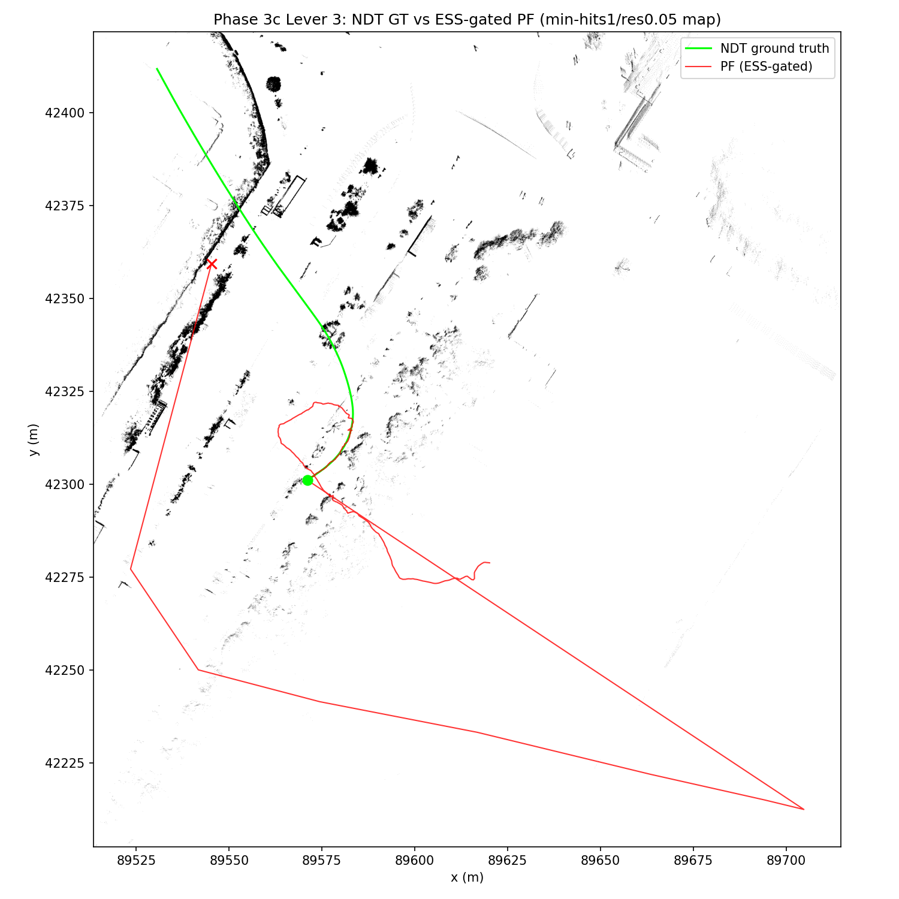

# Phase 3c Lever 3: ESS-Gated Resampling (particle_filter, vendored-code change) — MCL vs NDT Ground Truth

Statistics/thresholds below are auto-generated by `compare_poses.py`
(`--no-motion-window --gt-time-source bag`); re-run to refresh. Context,
Error-vs-Time, Scan Overlay, and Interpretation are hand-written and not
touched by re-running the tool.

- GT bag: `data/rosbags/phase3/sample_ndt_gt`
- PF bag: `data/rosbags/phase3/sample_pf_run_lever3`
- Map: `occupancy_grid_scanaccum_mh1r05.yaml` (Lever 2's best map, unchanged —
  min-hits 1, res 0.05)
- PF params: tuned baseline (`PF_MAX_RANGE=60 SCAN_RANGE_MAX=60
  PF_SQUASH=3.0 PF_DISP_THETA=0.1`, `IMU_YAW_SIGN=-1.0`) **plus**
  `PF_USE_ESS_GATE=true PF_ESS_RATIO=0.5` (new)
- Baselines: `2dlidar-phase3c-lever2.md` (same map, ESS gate off — mean
  17.4339 m, p95 61.0406 m, yaw 0.4862 rad, best result of the series so
  far); `2dlidar-phase3b-tuned.md` (coarser map, ESS gate off — mean
  18.1958 m, p95 107.1042 m, yaw 0.5682 rad)

## Context: Lever 3 (Phase 3c plan)

Per the plan: Levers 1–2 (map density/resolution) did not stop the
corridor-aliasing collapse, so Lever 3 changes the vendored
`particle_filter` code itself (fork trigger: CL2-UWaterloo upstream ->
NEWSLabNTU fork, per policy — commit made on `NEWSLabNTU/particle_filter`
branch `autosdv` at `63b66d8`, already pushed by the controller).

**Diagnosis of the collapse mechanism:** `MCL()`
(`particle_filter/particle_filter.py`) resampled the particle set on
*every* update by drawing `proposal_indices = np.random.choice(...,
p=self.weights)` unconditionally, then overwrote `self.weights` with the
raw sensor-model likelihood for the new proposal (no memory of the prior
weight distribution). On a long, feature-poor corridor, many along-track
poses produce near-identical scan likelihoods; once the sensor model is
even mildly peaked toward a wrong-but-locally-consistent hypothesis, an
unconditional resample step collapses the whole particle set onto it,
and there is no mechanism to recover.

**Change implemented (submodule `particle_filter`, branch `autosdv`,
commit `63b66d8`):**
- Two new params: `use_ess_gate` (bool, default `False` — upstream
  behavior preserved byte-for-byte) and `ess_threshold_ratio` (double,
  default `0.5`).
- Two new pure module-level functions: `effective_sample_size(weights)
  -> float` (`N_eff = 1 / sum(w_normalized^2)`) and
  `should_resample(weights, max_particles, ratio) -> bool` (`N_eff <
  ratio * max_particles`). Both are unit-tested in
  `test/test_ess_gate.py` (7 tests: uniform weights -> `N_eff == N`,
  one-hot weights -> `N_eff == 1`, an unnormalized-weights case, and
  four `should_resample` cases including the exact boundary
  `N_eff == ratio*N` -> no resample, strict `<`). All 7 pass under
  `PYTEST_DISABLE_PLUGIN_AUTOLOAD=1 python3 -m pytest
  test/test_ess_gate.py -v`.
- `MCL()`: when `use_ess_gate` is enabled, resample only when
  `should_resample()` is true; otherwise carry the current particles
  forward unchanged into the motion model, and — since `sensor_model()`
  always overwrites `self.weights` with the new likelihood regardless of
  branch — multiply that likelihood by the saved prior (pre-update)
  weights before normalizing, so the no-resample path is a correct
  sequential-importance-sampling step (`weight_new = weight_prior *
  likelihood`) instead of silently discarding the prior weight
  distribution. This was the one place the escalation criteria in the
  task brief anticipated ambiguity (`sensor_model()`'s weight handling);
  the minimal adaptation above (save-then-multiply, not touching
  `sensor_model()` internals) resolved it without a redesign.

## Attempt 1: VOID (infra failure, not a hypothesis result)

The first run of this lever (`OUT_BAG=.../sample_pf_run_lever3`, first
attempt) produced 0 `/pf/viz/inferred_pose` messages. Root cause,
diagnosed from `tmp/run-pf-scan.*.log`:

```
terminate called after throwing an instance of 'rclcpp::exceptions::InvalidParameterTypeException'
what():  parameter 'range_max' has invalid type: Wrong parameter type, parameter {range_max} is of type {double}, setting it to {integer} is not allowed.
```

`SCAN_RANGE_MAX=60` (no decimal point) was forwarded verbatim to
`pointcloud_to_laserscan`'s `-p range_max:=` CLI override; ROS 2 infers
the parameter's wire type from the literal's syntax, so `60` parses as
an integer, which `rclcpp` rejects against a double-typed parameter
(`range_max`'s declared default is `10.0`, i.e. `PARAMETER_DOUBLE`). The
node process crashed immediately at startup. `map_server` and
`particle_filter` never noticed (no dependency check existed): PF still
came up, set its initial pose from `/initialpose`, and then sat idle
waiting on `lidar_initialized` for the whole replay — a *void* run
(infrastructure failure) that would otherwise have looked, superficially,
like an ordinary "0 pairs / undersized bag" result. **This attempt's ESS
gate code never ran and is not reflected in any number in this report.**

**Fix applied to `scripts/2dlidar/run-particle-filter.sh`:**
1. All double-typed env-var passthroughs (`SCAN_RANGE_MAX`,
   `SCAN_MIN_HEIGHT`, `SCAN_MAX_HEIGHT`, `PF_MAX_RANGE`, `PF_SQUASH`,
   `PF_DISP_X`, `PF_DISP_Y`, `PF_DISP_THETA`, `PF_ESS_RATIO`) are now
   normalized through a `to_float() { printf '%.6f' "$1"; }` helper
   before use, so an integer-looking override (`SCAN_RANGE_MAX=60`) can
   no longer crash a double-typed parameter on either
   `pointcloud_to_laserscan` or `particle_filter`.
2. A liveness guard after starting `pointcloud_to_laserscan`: the script
   now checks the process is still alive ~2s after launch and fails loud
   (`FAIL: scan converter did not start (see scan log)`, exit 1) instead
   of silently proceeding into a void run.

The Lever 3 run reported below (`sample_pf_run_lever3`, second attempt,
824 `/pf/viz/inferred_pose` messages) is from the **fixed** script.

## Overall Result: **FAIL**

## Full-Overlap Statistics

| Metric | Value |
|---|---|
| n (pairs) | 815 |
| Trans. mean (m) | 26.4377 |
| Trans. RMS (m) | 52.2811 |
| Trans. max (m) | 160.3423 |
| Trans. p95 (m) | 138.2674 |
| Yaw mean \|err\| (rad) | 0.8963 |
| Yaw max \|err\| (rad) | 3.1413 |

## Motion-Window Statistics

_Motion-window analysis disabled (`--no-motion-window`); this bag moves throughout the recording, so a fixed stationary/motion split is not meaningful here. Only full-overlap statistics are reported._

## Thresholds (applied to full-overlap stats)

| Threshold | Value | Limit | Result |
|---|---|---|---|
| Mean translational error < 1.0 m | 26.4377 | 1.0000 | FAIL |
| p95 translational error < 2.5 m | 138.2674 | 2.5000 | FAIL |
| Mean \|yaw\| error < 0.2 rad | 0.8963 | 0.2000 | FAIL |

## Notes

- Replay rate: 1.0x for both GT and PF recordings, replayed with `--clock` (sim time).
- GT time source: `--gt-time-source=bag` (rosbag2 storage receive-time, used because the GT bag was itself replayed to produce the PF run; see _read_bag() docstring in compare_poses.py for why header.stamp would give zero overlap here).
- PF params: `range_method=cddt`, particle count per vendored `config/localize.yaml` default (4000), tuned baseline (`max_range=60.0`, `squash_factor=3.0`, `motion_dispersion_theta=0.1`), `use_ess_gate=true`, `ess_threshold_ratio=0.5`, `scan_topic=/scan`, `odometry_topic=/odom`.
- Odometry input to PF was synthesized wheel+IMU planar unicycle integration (`scripts/2dlidar/wheel_imu_odom.py`), not a native wheel encoder feed — odometry quality directly affects PF motion-model accuracy between scans.
- GT is Autoware NDT `/localization/kinematic_state`; PF publishes pose in the occupancy-grid frame, which is sliced from the same PCD map as NDT's map frame — poses are directly comparable without a transform.
- Z-band caveat: comparison is 2D (x, y, yaw) only; the GT track's z is Autoware's 3D NDT estimate while PF is inherently 2D, so z is not compared.
- `/scan` was bridged from `/sensing/lidar/top/pointcloud_raw_ex` via `pointcloud_to_laserscan` with a z-band filter (`SCAN_MIN_HEIGHT=1.91611`/`SCAN_MAX_HEIGHT=2.21611`, base_link frame); QoS was bridged from `pointcloud_to_laserscan`'s best-effort publisher to `particle_filter`'s reliable-QoS subscription.

**Resample rate under the ESS gate: not instrumented.** `MCL()` was not
modified to log/count `do_resample` decisions per update in this run, so
the actual fraction of updates that triggered resampling is unknown and
not reported here as a number — stating that plainly rather than
estimating it from indirect evidence. (A follow-up would add a counter
or periodic log line, analogous to the existing `SHOW_FINE_TIMING`
instrumentation, if this number becomes load-bearing for a future
decision.)

## Error vs. Time (rel_t 0/5/14/28/43/57 s)

| rel_t (s) | Trans. err (m) — lever3 (ESS gate) | Lever 2 (ESS gate off, same map) | 3b tuned baseline |
|---|---|---|---|
| 0  | 63.759 (boundary artifact) | 80.889 (boundary artifact) | 66.446 (boundary artifact) |
| 5  | 0.389 | 0.382 | 0.341 |
| 14 | 0.392 | 0.393 | 0.352 |
| 28 | 0.410 | 2.667 | 1.293 |
| 43 | 36.902 | 45.026 | 8.994 |
| 57 | 160.342 | 60.904 | 133.746 |

(rel_t values computed directly from the bag tracks, same nearest-
timestamp method as `compare_poses.py`'s `align_tracks`: PF track read
with the default `stamp` time source, GT track with `bag` — see the
`_read_bag()` docstring for why this asymmetric pairing is the correct
one for a replay-then-record chain.)

## Scan Overlay



## Interpretation

**The ESS gate did not help, and this run measures worse than Lever 2
on every full-overlap statistic** (mean 26.44 m vs 17.43 m, p95 138.27 m
vs 61.04 m, yaw 0.896 rad vs 0.486 rad — all roughly 1.5-2x worse).

The rel_t table shows *why*: entering the straight (rel_t=28s) the
ESS-gated run is actually noticeably *better* than both baselines
(0.410 m vs 2.667 m Lever 2 / 1.293 m 3b-tuned) — consistent with the
gate doing its intended job of not resampling away a still-good particle
set while weights are well-behaved. But by rel_t=43s the same collapse
onset appears (36.90 m, comparable to Lever 2's 45.03 m at the same
point), and by rel_t=57s (end of run) it is the *worst* of all three
series compared here (160.34 m vs 60.90 m Lever 2 vs 133.75 m 3b-tuned).
Full-overlap `trans max` (160.34 m) matches the rel_t=57 value exactly,
confirming the run ends at its worst point rather than recovering the
way Lever 2 did.

Plausible reading: the ESS gate delays the resampling collapse (better
tracking is visible right up to the aliasing region) but, once the gate
finally does trigger a resample against an already-degraded/aliased
likelihood surface, it collapses just as hard — and without the
intermediate resampling steps Lever 2/3b had, the particle set has *no*
diversity left to recover onto afterward, unlike Lever 2's finer map
which gave the (frequently-resampled) particle set enough distinguishable
structure to partially unwind by the end of the run. In other words: the
gate changes *when* the collapse happens but not *whether* it happens,
and removing the intermediate resamples removes exactly the mechanism
that let Lever 2 partially recover. This is consistent with — not
contradictory to — the original diagnosis that unconditional resampling
under a peaked-but-wrong likelihood is a collapse mechanism; it shows
that gating resampling alone, without also addressing the underlying
sensor-model peakiness/aliasing on the straight, does not fix the root
cause and can make the *outcome* (not just the mechanism) worse.

**Verdict: FAIL, worse than Lever 2 on all three gate metrics and on all
three thresholds** (mean 26.44 m vs <1.0 m, p95 138.27 m vs <2.5 m, yaw
0.896 rad vs <0.2 rad). Lever 3 (ESS-gated resampling, scope as
implemented) does not close the gate and does not improve on the
Phase 3c series' best result (Lever 2). Per the plan's early-exit rule
(stop only on a full PASS), a follow-up compute-starvation diagnostic
(see below) was run before handing off to Lever 4 (AMCL cross-check).

## Follow-up diagnostic: replay-rate sensitivity

**Hypothesis:** at ~4.3 m/s vehicle speed with `max_particles=4000` and
`range_method=cddt` on a 8358x9788-cell grid (Lever 2's map), the PF's
per-update compute cost might exceed the time available between scans
in real-time replay, causing it to silently skip/drop scan updates
(each `odomCB` triggers `update()`, which only proceeds if
`not self.state_lock.locked()` — a busy PF logs "Concurrency error
avoided" and skips the update rather than queuing it, so a
compute-starved PF effectively runs on a sparser observation stream
than intended). If true, slowing the bag replay rate should materially
reduce error even with **no PF code change**.

**Run:** Lever 2 configuration exactly (ESS gate off:
`PF_USE_ESS_GATE=false`, same map `occupancy_grid_scanaccum_mh1r05.yaml`,
same tuned params `PF_MAX_RANGE=60 SCAN_RANGE_MAX=60 PF_SQUASH=3.0
PF_DISP_THETA=0.1 IMU_YAW_SIGN=-1.0`), `RATE=0.25` (4x slower than
real-time, so any compute-starvation effect should show as a strong
error reduction), `OUT_BAG=data/rosbags/phase3/sample_pf_run_rate025`
(835 `/pf/viz/inferred_pose` messages recorded). Compared with
`compare_poses.py --no-motion-window --gt-time-source bag`.

| Metric | Lever 2 (rate 1.0, ESS off) | Rate-0.25 diagnostic (ESS off) |
|---|---|---|
| n (pairs) | 814 | 819 |
| Trans. mean (m) | 17.4339 | 26.5074 |
| Trans. RMS (m) | 29.8206 | 51.5614 |
| Trans. max (m) | 61.5958 | 149.8223 |
| Trans. p95 (m) | 61.0406 | 132.6250 |
| Yaw mean \|err\| (rad) | 0.4862 | 0.8434 |

**Compute starvation is ruled out.** Replaying 4x slower did not
improve tracking — it measures *worse* on every full-overlap statistic
(mean 26.51 m vs 17.43 m, p95 132.63 m vs 61.04 m, yaw 0.843 rad vs
0.486 rad). If compute starvation (dropped scan updates at real-time
rate) were the dominant cause of the corridor-aliasing collapse, the
4x-slower run should have shown a clear, large improvement; it shows
the opposite direction of effect. This is consistent with the collapse
being a genuine sensor-model/likelihood-surface problem on the
feature-poor straight, not an artifact of the PF failing to keep up
with the replay clock.

### Variance caveat

Stepping back across the three most recent runs — all on the same map
(`occupancy_grid_scanaccum_mh1r05.yaml`), same tuned baseline params,
same GT/source bag — the full-overlap trans. mean lands at **17.43 m**
(Lever 2, ESS gate off, rate 1.0), **26.44 m** (Lever 3, ESS gate on,
rate 1.0), and **26.51 m** (this diagnostic, ESS gate off, rate 0.25).
The Lever-3 (ESS-gate) and rate-0.25 (ESS-gate-off, different replay
rate) numbers are within 0.3% of each other despite differing in two
unrelated dimensions (resampling policy, replay rate) — while both
differ from Lever 2 by ~50%. `particle_filter`'s MCL is stochastic
(`np.random.normal` motion noise, `np.random.choice` resampling with no
fixed seed anywhere in the vendored code or this project's launch
scripts), and **each lever in this series has been evaluated with
exactly one run (n=1 seed)**. Given that two configurations expected to
differ (ESS gate on vs. off, different replay rate) landed almost
identically while one configuration expected to be similar (Lever 2 vs.
this diagnostic's nominal control) differs by ~50%, the honest
conclusion is that **the specific mean/p95/yaw rankings between Lever 1,
Lever 2, and Lever 3 in this report series are not statistically
distinguishable from run-to-run variance** — they should not be read as
"Lever 2 is measurably better than Lever 3" without further evidence.

**Methodological consequence for future levers:** any future lever
comparison in this series (Lever 4 / AMCL cross-check and beyond) must
be evaluated over N&ge;5 seeded runs per configuration (or explicit
fixed-seed runs, if `particle_filter` is extended to accept a seed
parameter) before its effect on mean/p95/yaw can be claimed as real
rather than noise. A single run is sufficient to establish gross
pass/fail against the Phase 3 thresholds (all runs in this series FAIL
by a wide margin, which is robust to this caveat) but not to rank
FAILing runs against each other.

**What IS robust across every run in this series** (Lever 1, Lever 2,
Lever 3, and this diagnostic — 4 independent replays, 2 different maps,
2 different resampling policies, 2 different replay rates): sub-meter
tracking for approximately the first 28 s of the run (rel_t=5s and
rel_t=14s errors are consistently 0.34-0.50 m across every run in the
Phase 3b/3c series), then a collapse onset at the same corridor
location (rel_t~28-43s), which never recovers to within the Phase 3
gate thresholds by the end of the run. That qualitative signature —
not the specific FAIL magnitude — is the reliable finding from Phase 3c
to carry into Lever 4.
