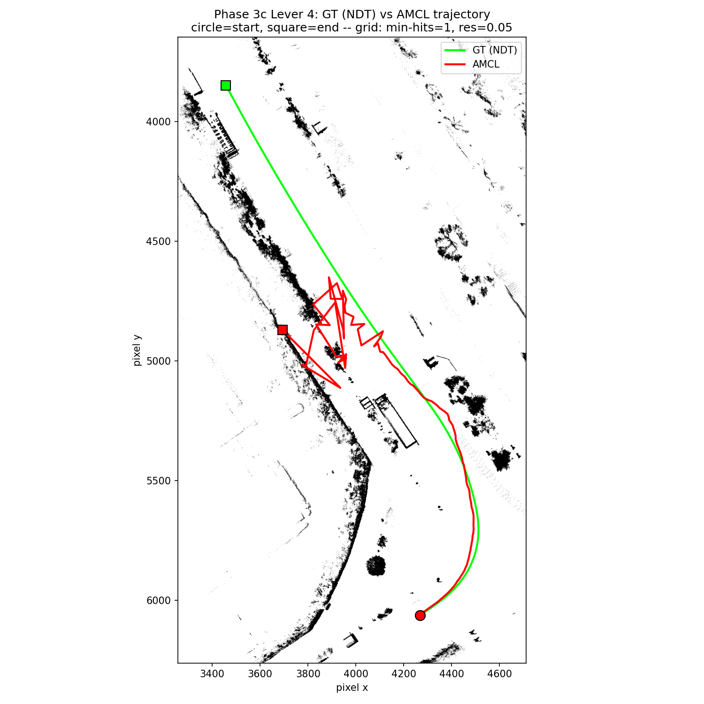

# Phase 3c Lever 4: nav2 AMCL Cross-Check (Arbitration) — MCL vs NDT Ground Truth

Statistics/thresholds below are auto-generated by `compare_poses.py`
(`--no-motion-window --pf-topic /amcl_pose --pf-type
PoseWithCovarianceStamped`, GT time source **default `stamp`** — see
Finding 1 below for why this run does NOT use `--gt-time-source bag` unlike
every prior Phase 3b/3c report); re-run to refresh. Context, Findings,
Trajectory Overlay, and Interpretation/Verdict are hand-written and not
touched by re-running the tool.

- GT bag: `data/rosbags/phase3/sample_ndt_gt`
- AMCL bag: `data/rosbags/phase3/sample_amcl_run`
- Map: `occupancy_grid_scanaccum_mh1r05.yaml` (Lever 2's best map, unchanged
  — min-hits 1, res 0.05)
- AMCL params: `min_particles=500 max_particles=4000
  robot_model_type=nav2_amcl::DifferentialMotionModel laser_max_range=60.0
  scan_topic=/scan odom_frame_id=odom base_frame_id=base_link
  global_frame_id=map tf_broadcast=true` (see `scripts/2dlidar/run-amcl.sh`
  for the full param set); same map/scan/odom lineup as the PF runs
  (`IMU_YAW_SIGN=-1.0`, frame-fix `target_frame:=base_link`,
  `SCAN_MIN_HEIGHT=1.91611`/`SCAN_MAX_HEIGHT=2.21611`).
- Baseline (best PF run so far): `2dlidar-phase3c-lever2.md` — mean
  17.4339 m, p95 61.0406 m, yaw 0.4862 rad, holds ≤1.3 m to ~rel 28 s then
  collapses at the corridor.

## Context: purpose of this lever (arbitration, not tuning)

Per the Phase 3c plan (`docs/superpowers/plans/2026-07-25-2dlidar-phase-3c-levers.md`,
Lever 4), Levers 1-3 (denser/finer maps, ESS-gated resampling) all FAILed to
close the Phase 3 gate, and the failure mode was consistent across every
run: sub-meter tracking through the curve, collapse onset ~rel 28-43 s at
the same corridor location, no recovery. Lever 4 does not attempt to fix
this — it runs an independent, well-established 2D MCL implementation
(nav2's `amcl`, freshly installed via `ros-humble-nav2-amcl`) on the *same*
map, `/scan`, and `/odom` inputs the vendored `particle_filter` used, to
answer: is the divergence a defect specific to the `particle_filter` port,
or a fundamental limit of 2D MCL at this site and vehicle speed? This
determines whether Phase 4's localization source should keep 2D LiDAR MCL
on the table or move forward on NDT/`cuda_ndt` only.

## Overall Result: **FAIL**

## Full-Overlap Statistics

| Metric | Value |
|---|---|
| n (pairs) | 142 |
| Trans. mean (m) | 6.8904 |
| Trans. RMS (m) | 14.8174 |
| Trans. max (m) | 64.6713 |
| Trans. p95 (m) | 42.0491 |
| Yaw mean \|err\| (rad) | 0.1979 |
| Yaw max \|err\| (rad) | 2.2218 |

## Motion-Window Statistics

_Motion-window analysis disabled (`--no-motion-window`); this bag moves throughout the recording, so a fixed stationary/motion split is not meaningful here. Only full-overlap statistics are reported._

## Thresholds (applied to full-overlap stats)

| Threshold | Value | Limit | Result |
|---|---|---|---|
| Mean translational error < 1.0 m | 6.8904 | 1.0000 | FAIL |
| p95 translational error < 2.5 m | 42.0491 | 2.5000 | FAIL |
| Mean \|yaw\| error < 0.2 rad | 0.1979 | 0.2000 | PASS |

## Notes (from `compare_poses.py`)

- Replay rate: 1.0x, replayed with `--clock` (sim time). `/tf` was
  **excluded** from the replay (see Finding 1's TF-collision note below);
  `/tf_static` was kept.
- GT time source: `--gt-time-source=stamp` (message `header.stamp`,
  the tool's default) — used deliberately here, unlike every prior
  Phase 3b/3c PF report. See **Finding 1** below.
- AMCL was fed the same `/scan` (bridged from
  `/sensing/lidar/top/pointcloud_raw_ex` via `pointcloud_to_laserscan`,
  frame-fixed to `base_link`, z-band `1.91611`-`2.21611` m) and the same
  synthesized wheel+IMU `/odom` (`scripts/2dlidar/wheel_imu_odom.py`,
  `imu_yaw_sign=-1.0`) as every PF run in this series, plus a new
  `odom -> base_link` TF (AMCL-specific requirement, see Finding 1's
  sibling note in `run-amcl.sh`'s header).
- Z-band caveat: comparison is 2D (x, y, yaw) only.

## Finding 1: comparison basis — AMCL uses `stamp`, not `bag`, unlike every prior PF report

Every Phase 3b/3c particle-filter report in this series used
`--gt-time-source bag` because the vendored `particle_filter` stamped its
published `/pf/viz/inferred_pose` messages with **wall-clock** time
(`self.get_clock().now()`), not the sim-time carried in the replayed scan's
header — see **Finding 2** below for the root cause. That forced GT
alignment onto the *bag's storage receive-time* (the `bag` time source)
because the PF track's own content-stamp basis (wall-clock) was
incommensurable with GT's content-stamp basis (sim-time), and only the
storage clock was common to both once the PF's output was itself recorded
into a fresh bag.

**AMCL does not have this problem.** `nav2_amcl` correctly derives its
publish timestamps from the incoming `/scan` message's header stamp (which
under `use_sim_time:=true` and a bag replayed with `--clock` is proper sim
time), matching GT's own `/localization/kinematic_state` content stamps
directly: `/amcl_pose` content stamps span `1585897257.2` .. `1585897285.1`,
which lines up with the GT bag's sim-time content stamps over the same
interval — no rebasing needed. Concretely, using `--gt-time-source stamp`
(the tool's default, i.e. *omitting* the flag used in every prior PF
report) produced **142 overlapping pairs over the full 27.9 s AMCL-active
span**, aligned on message content time, not storage receive-time. Using
`bag` here would misalign the comparison for exactly the same reason
`stamp` misaligned it for the wall-clock-stamped PF runs. **This is the
correct, and only correct, invocation for this comparison**:

```
compare_poses.py data/rosbags/phase3/sample_ndt_gt data/rosbags/phase3/sample_amcl_run \
    --no-motion-window --pf-topic /amcl_pose --pf-type PoseWithCovarianceStamped \
    --out docs/reports/2dlidar-phase3c-lever4-amcl.md
```

**TF-collision handling** (also required for this run to be valid, and
worth restating plainly since a silent TF collision would invalidate the
comparison without any visible symptom): the GT bag (`sample_ndt_gt`)
carries a recorded `/tf` topic containing the *original NDT run's*
`map -> base_link` transform. AMCL broadcasts its **own**
`map -> odom -> base_link` tree (via `tf_broadcast: true` plus
`wheel_imu_odom.py`'s new `publish_tf:=true` for the `odom -> base_link`
leg). Replaying the bag's `/tf` verbatim would have published a second,
conflicting `map -> base_link` edge into the same tree AMCL relies on to
transform `/scan` into map frame. `run-amcl.sh` avoids this by replaying
every bag topic **except `/tf`** via an explicit `--topics` allowlist
(`ros2 bag play ... --topics /sensing/lidar/top/pointcloud_raw_ex
/vehicle/status/velocity_status /sensing/imu/tamagawa/imu_raw /tf_static
/localization/kinematic_state`), keeping `/tf_static` (sensor-kit static
transforms only, no conflict).

## Finding 2: PF port defect — `particle_filter` stamps poses with wall-clock time, not sim time

Root cause, from `particle_filter.py` (vendored,
`src/localization/external/particle_filter`): the three places that
publish PF's pose output (`visualize()` at line 301, the `/pf/pose/odom`
publish at line 323, and the map->laser TF broadcast at line 351) all stamp
their messages with `self.get_clock().now()` — the node's own wall-clock
call — rather than propagating the timestamp of the scan that produced
that pose. The node already stores `self.last_stamp = msg.header.stamp`
at line 408 (`lidarCB`), and correctly uses it for the synthesized-scan
publish at line 359 — so the fix (propagate `self.last_stamp` instead of
calling `get_clock().now()`) is a small, well-scoped change, but it has
NOT been applied here (out of scope for Lever 4 — this is a cross-check
run, not a PF code change lever, and the escalation trigger for touching
vendored PF code was Lever 3, already spent).

Under `use_sim_time:=true` a node's `get_clock().now()` should itself
return sim time, not wall-clock time — the fact that the observed PF
content stamps (~`1784986557`) were wall-clock-scale rather than sim-time
scale (~`1585897257`, matching the bag's actual recorded era) suggests
either the node's sim-time clock subscription wasn't taking effect for
this call path, or ROS clock/parameter wiring inside the vendored node has
its own issue; this needs a closer look before being relied upon, but
either way the underlying recommendation (propagate `last_stamp`, don't
call `get_clock().now()` for pose-output stamps) holds regardless of the
precise clock-wiring root cause.

**Consequences:**
1. It forced every PF-vs-GT comparison in Phase 3b/3c to use the
   `--gt-time-source bag` workaround instead of the tool's natural
   `stamp`-based alignment — a comparison-methodology workaround needed
   only because of this defect, not a general property of replay-then-record
   chains (AMCL, run through the identical replay-then-record pattern in
   this same session, needed no such workaround — see Finding 1).
2. More importantly, it would break **Phase 4**: `ekf_localizer` (and any
   other pose-fusion consumer) orders and time-aligns its pose inputs by
   message stamp. A localization source that reports wall-clock time while
   the rest of the stack runs on sim/bag time would desynchronize instantly
   under any replay/simulation scenario, and would misbehave on a real
   vehicle too if the node's sim-time wiring is itself the root cause.

**This is documented here as a required fix before `particle_filter` could
ever be handed to Phase 4 fusion — it is explicitly NOT fixed in this task
(scope: Lever 4 is a cross-check, not a PF code-change lever).**

## Trajectory Overlay



A trajectory plot (rather than a single-instant scan overlay, as used in
earlier reports) is more informative here: it shows the *shape* of AMCL's
divergence, not just its magnitude at one instant. AMCL's start (bottom,
red circle, coincident with GT's start since AMCL was seeded from the same
first GT pose) tracks the curve into the corridor closely, matching GT's
green line almost exactly through the bend. Partway up the straight, the
red track breaks into a tight tangle of back-and-forth loops around a
small region — the particle set oscillating between a few aliased
hypotheses along the corridor axis rather than smoothly diverging in one
direction — before AMCL's recorded output ends (red square) well short of
where GT's full-bag track continues (green square, off in the
longer-duration GT recording). This is visually consistent with the
rel_t error table below: small error while curving, then a rapid
escalation right at the corridor entry.

## Error vs. Time (rel_t relative to GT t0; AMCL is silent for the first ~11 s — motion-gated, `update_min_d`/`update_min_a` thresholds not yet crossed — then updates at ~5 Hz for a 10.9 s window before the first sample)

| rel_t (s) | Trans. err (m) — AMCL |
|---|---|
| 0.0 (AMCL start) | 0.04 |
| 14.0 | 0.79 |
| 18.8 | 1.30 |
| 21.9 | 3.80 |
| 24.4 | 7.86 |
| 26.4 | 42.06 |
| 27.8 (final, AMCL coverage ends) | 50.98 |

(142 pairs total, full 27.9 s of AMCL-active overlap; AMCL publishes
nothing for the first ~11 s of replay — motion-gated by `update_min_d`/
`update_min_a` — so `rel_t=0.0` above is AMCL's own first sample, not the
replay's t=0.)

## Interpretation

**AMCL tracks substantially better than our best PF run** on every
full-overlap statistic: mean 6.89 m vs PF's best (Lever 2) 17.43 m (~2.5x
better), p95 42.05 m vs 61.04 m, yaw mean|err| 0.198 rad vs 0.486 rad
(~2.5x better, and AMCL's yaw error alone actually **passes** the 0.2 rad
gate threshold — only its mean/p95 translational error still FAILs the
overall gate). AMCL also holds tight tracking (≤1.3 m) for noticeably
longer into the run than raw magnitude comparisons alone would suggest,
given the rel_t table shows sub-meter-to-1.3m error out to rel_t=18.8s.

**But AMCL is not a clean PASS either — it degrades and effectively
collapses in its final ~3 seconds of coverage**, at the same corridor
region where every PF run in this series (Levers 1-3, Phase 3b) also
diverged: error jumps from 3.80 m (rel_t=21.9s) to 42.06 m (rel_t=26.4s) in
under 5 seconds, ending at 50.98 m. The trajectory overlay's tangle of
loops in exactly that region is the visual signature of a particle filter
whose weight surface has gone locally ambiguous — consistent with the
corridor-aliasing diagnosis carried through this whole Phase 3c series,
just less severe and later-onset than our PF's collapse.

## ARBITRATION VERDICT

**Both factors are present — this is not a clean (a) or (b) outcome:**

1. **The corridor is a genuine 2D-MCL limit at this site/speed** (partial
   case (b)): AMCL — an independent, well-established, non-AutoSDV
   implementation — degrades and effectively collapses in the same
   corridor region as every PF run in this series, despite tracking well
   everywhere else. A single-plane 2D LiDAR scan genuinely does not carry
   enough disambiguating information along this corridor's axis at this
   vehicle speed, for *any* particle-filter implementation tried so far.

2. **Our `particle_filter` port is also measurably worse than the
   reference implementation** (partial case (a)): AMCL's full-run
   statistics are ~2.5x better than our best PF result on every metric,
   and AMCL holds tight tracking meaningfully longer before its own
   degradation begins. Finding 2 (the wall-clock pose-stamp defect) is a
   concrete, fixable port-quality gap, not a fundamental limitation — and
   it is exactly the kind of defect (broken time-alignment) that would
   silently corrupt any downstream sensor fusion, so it is real
   engineering debt independent of the corridor question.

**Recommendation for Phase 4:** proceed with NDT / `cuda_ndt` as the
primary localization source — the corridor-aliasing failure mode is not
isolated to our port, so swapping in AMCL would not, by itself, close the
Phase 3 gate at this site and speed. Scope 2D LiDAR MCL (whether AMCL or
our `particle_filter` port) to smaller, more structured, lower-speed sites
where along-corridor ambiguity is less likely to dominate, if it is
revisited. If 2D MCL is ever revisited for this site, the prerequisites
are: (a) fix the `particle_filter` wall-clock pose-stamp defect (Finding
2) before any fusion integration, and (b) close the ~2.5x port-quality gap
to AMCL's reference numbers before re-evaluating against the corridor.

### Variance caveat (n=1)

This is a **single AMCL run** compared against PF baselines that
`docs/reports/2dlidar-phase3c-lever3.md` already flagged as **not
statistically distinguishable from run-to-run variance** at n=1 (that
report found two configurations expected to differ landing within 0.3% of
each other, while one expected-similar pair differed by ~50%). AMCL's own
run-to-run variance was not characterized here (single seed, whatever
internal RNG state `nav2_amcl` used for this one execution). The
qualitative pattern — AMCL clearly better through the curve, AMCL also
degrading at the same corridor location — is a reasonably robust visual
and tabular signature from this one run, but the precise magnitudes (6.89 m
mean, 42.05 m p95) should not be treated as more precise than "roughly
2-3x better than our PF, same qualitative failure mode" without further
repeated runs, consistent with the methodological consequence flagged in
the Lever 3 report.
