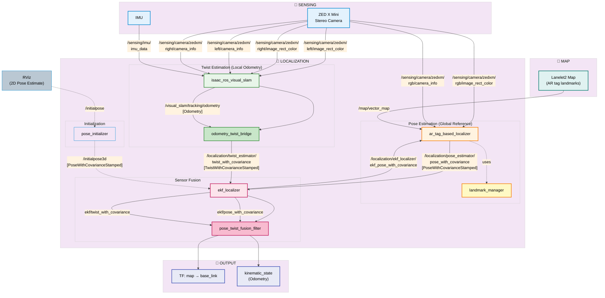

# AR Tag + Isaac Visual SLAM Integration

**Status:** Planning Phase
**Current Phase:** Phase 1 - Setup & Preparation

## Executive Summary

This integration adds AR Tag-based global localization with Isaac Visual SLAM to solve the global reference problem in camera-only localization for AutoSDV.

**Problem Statement:**
- Isaac Visual SLAM provides excellent local visual odometry but lacks global map reference
- Accumulated drift over time causes pose estimation errors
- Need camera-only solution (YabLoc requires road marking maps unavailable in our field)

**Proposed Solution:**
- Use AR Tag-based localization for global reference (periodic corrections)
- Use Isaac Visual SLAM for local odometry (high-rate smooth tracking)
- Fuse both sources in EKF Localizer for drift-free global pose

---

## Quick Links

**Implementation Phases:**
- [Phase 1: Setup & Preparation](phase_1_setup.md) - 🚧 In Progress
- [Phase 2: AR Tag Map Creation](phase_2_map_creation.md) - ⏸️ Pending
- [Phase 3: AR Tag Localizer Integration](phase_3_localizer.md) - ⏸️ Pending
- [Phase 4: Isaac VSLAM Modification](phase_4_vslam.md) - ⏸️ Pending
- [Phase 5: EKF Fusion Configuration](phase_5_fusion.md) - ⏸️ Pending
- [Phase 6: Integration Testing](phase_6_testing.md) - ⏸️ Pending
- [Phase 7: Documentation & Deployment](phase_7_deployment.md) - ⏸️ Pending

---

## System Architecture

### Current State (Isaac VSLAM Only)

```
┌──────────────────────────────────────────────┐
│  Isaac Visual SLAM                           │
│  - Stereo camera input                       │
│  - cuVSLAM processing                        │
│  - Outputs: Visual odometry (local frame)    │
└──────────────┬───────────────────────────────┘
               │
               ▼
┌──────────────────────────────────────────────┐
│  odometry_pose_bridge                        │
│  - Converts odometry → pose                  │
│  - Outputs: /localization/pose_with_cov      │
└──────────────┬───────────────────────────────┘
               │
               ▼
┌──────────────────────────────────────────────┐
│  EKF Localizer                               │
│  - Treats Isaac VSLAM as global pose source  │
│  - Problem: DRIFT accumulation               │
└──────────────────────────────────────────────┘
```

**Issue:** No global reference → unbounded drift

### Target State (AR Tag + Isaac VSLAM Fusion)

```
┌─────────────────────────────────────────────────────────────┐
│                    GLOBAL REFERENCE                          │
│  ┌──────────────────────────────────────────────────────┐   │
│  │  AR Tag Localizer (Autoware Component)              │   │
│  │  - Camera image input                                │   │
│  │  - ArUco marker detection                            │   │
│  │  - Landmark map matching (Lanelet2)                  │   │
│  │  - Outputs: /localization/pose_estimator/pose (10Hz)│   │
│  └──────────────────────────────────────────────────────┘   │
└─────────────────────────────────────────────────────────────┘
                              │
                              ├────────────────────────┐
                              │                        │
┌─────────────────────────────▼─────────────────────┐  │
│                LOCAL ODOMETRY                      │  │
│  ┌────────────────────────────────────────────┐   │  │
│  │  Isaac Visual SLAM                         │   │  │
│  │  - Stereo camera input                     │   │  │
│  │  - cuVSLAM processing                      │   │  │
│  │  - Outputs: Visual odometry                │   │  │
│  └────────────┬───────────────────────────────┘   │  │
│               ▼                                    │  │
│  ┌────────────────────────────────────────────┐   │  │
│  │  odometry_twist_bridge (NEW)               │   │  │
│  │  - Converts odometry → twist/velocity      │   │  │
│  │  - Outputs: /localization/twist_with_cov   │   │  │
│  └────────────────────────────────────────────┘   │  │
└───────────────────────────┬────────────────────────┘  │
                            │                           │
                            ▼                           │
┌─────────────────────────────────────────────────────────┐
│                      EKF LOCALIZER                       │
│  - Fuses: Global pose (AR tags) + Local twist (VSLAM)   │
│  - Periodic AR tag corrections prevent drift             │
│  - High-rate VSLAM provides smooth tracking              │
│  - Outputs: map → base_link TF (drift-corrected)         │
└──────────────────────────────────────────────────────────┘
```

**Key Benefits:**
- ✅ Global map reference from AR tags
- ✅ Smooth high-rate tracking from Isaac VSLAM
- ✅ Drift-free pose estimation
- ✅ Camera-only solution (no LiDAR/GPS needed)

### Detailed Node Diagram

The following diagram shows the complete node architecture with topic flows based on Autoware's localization system:



**Diagram Legend:**
- **🔹 SENSING** (Blue): Hardware sensors providing raw data
- **Pose Estimation** (Orange): AR tag-based global localization
- **Twist Estimation** (Green): Isaac VSLAM local odometry
- **Sensor Fusion** (Pink): EKF and pose/twist fusion
- **🔹 MAP** (Teal): Lanelet2 map with AR tag landmarks
- **🔹 OUTPUT** (Indigo): Final localization outputs (TF, odometry)

**Key Data Flows:**
1. **Camera → AR Tag Localizer**: RGB image for marker detection
2. **Camera → Isaac VSLAM**: Stereo images for visual odometry
3. **IMU → Isaac VSLAM**: Inertial data for VIO fusion
4. **Map → AR Tag Localizer**: Landmark positions for pose calculation
5. **AR Tag → EKF**: Global pose corrections (periodic, ~10 Hz)
6. **Isaac VSLAM → EKF**: Local twist/velocity (continuous, ~30 Hz)
7. **EKF → AR Tag**: Validation feedback (reject outliers)
8. **EKF → Pose/Twist Filter**: Smoothed estimates for output

---

## Implementation Overview

### Phase Summary

| Phase | Description | Duration | Status |
|-------|-------------|----------|--------|
| [Phase 1](phase_1_setup.md) | Setup & Preparation | 1-2 days | 🚧 In Progress |
| [Phase 2](phase_2_map_creation.md) | AR Tag Map Creation | 2-3 days | ⏸️ Pending |
| [Phase 3](phase_3_localizer.md) | AR Tag Localizer Integration | 1-2 days | ⏸️ Pending |
| [Phase 4](phase_4_vslam.md) | Isaac VSLAM Modification | 2-3 days | ⏸️ Pending |
| [Phase 5](phase_5_fusion.md) | EKF Fusion Configuration | 2-3 days | ⏸️ Pending |
| [Phase 6](phase_6_testing.md) | System Integration Testing | 3-5 days | ⏸️ Pending |
| [Phase 7](phase_7_deployment.md) | Documentation & Deployment | 1-2 days | ⏸️ Pending |

**Total Estimated Duration:** 2-3 weeks (15-20 working days)

---

## Dependencies & Requirements

### Hardware Requirements

**Essential:**
- [x] ZED X Mini stereo camera (or equivalent)
- [x] NVIDIA GPU (for Isaac ROS Visual SLAM)
- [ ] Laser distance meter (±1cm accuracy)
- [ ] AprilTag 16h5 markers (7+ tags)

**Optional:**
- [ ] Total station (for large outdoor areas)
- [ ] Tripod for camera calibration
- [ ] Level tool for vertical alignment

### Software Dependencies

**ROS 2 Packages (Autoware):**
- `autoware_ar_tag_based_localizer` ✅ (in Autoware 1.5.0)
- `autoware_landmark_manager` ✅ (in Autoware 1.5.0)
- `autoware_ekf_localizer` ✅ (in Autoware 1.5.0)
- `aruco` library ✅ (dependency of AR tag localizer)

**Isaac ROS:**
- `isaac_ros_visual_slam` ✅ (already integrated)
- `isaac_ros_image_proc` ✅ (already integrated)

**AutoSDV Packages:**
- `odometry_pose_bridge` ✅ (exists, needs modification)
- `autosdv_isaac_slam_launch` ✅ (exists, needs update)
- `autosdv_launch` ✅ (exists, needs update)

**External Libraries:**
- OpenCV with ArUco support ✅
- ZED SDK 5.x ✅

### Map Requirements

**Lanelet2 Map with AR Tags:**
- Format: OSM XML with pose_marker polygons
- Minimum: 5-7 AR tag landmarks
- Coordinate precision: ±1cm
- Validation: Lanelet2 format checker (optional)

**Map Storage:**
- Location: `data/ar_tag_test_map/lanelet2_map.osm`
- Version control: Track in Git (text format)
- Backup: Keep measurement spreadsheet separate

---

## Risk Assessment

### Technical Risks

| Risk | Impact | Probability | Mitigation |
|------|--------|-------------|------------|
| **AR tag detection fails in poor lighting** | High | Medium | Test detection performance at different times of day; add lighting if needed |
| **Isaac VSLAM drift exceeds EKF tolerance** | High | Low | Tune EKF covariances; increase AR tag density |
| **Tag measurement errors cause pose jumps** | High | Medium | Use high-precision measurement tools; validate measurements |
| **Camera calibration drift over time** | Medium | Low | Periodic recalibration; monitor detection accuracy |
| **Duplicate tag IDs cause false positives** | Medium | Low | Careful ID assignment; use `ekf_position_tolerance` validation |
| **EKF divergence with conflicting measurements** | High | Low | Tune covariances; add diagnostic monitoring |

### Operational Risks

| Risk | Impact | Probability | Mitigation |
|------|--------|-------------|------------|
| **Tags damaged or moved after mapping** | High | Medium | Regular visual inspection; detect pose inconsistencies |
| **Vehicle operates outside tag coverage area** | Medium | High | Document coverage map; operator training |
| **Setup time exceeds budget** | Low | Medium | Pre-print tags; practice measurement procedure |
| **Map update workflow unclear** | Medium | Medium | Document map update procedure; version control |

---

## Success Criteria

### Technical Success

**Must Have:**
- ✅ Camera-only localization (no GPS/LiDAR dependency)
- ✅ Global map reference (no unbounded drift)
- ✅ Real-time performance (>10 Hz pose updates)
- ✅ AR tag detection range >5m
- ✅ Position accuracy <0.5m when tag visible

**Should Have:**
- ✅ Smooth tracking between tag detections
- ✅ Automatic drift correction on tag re-detection
- ✅ Diagnostic monitoring and alerts
- ✅ EKF stability in all test scenarios

**Nice to Have:**
- ✅ Multi-tag fusion (use multiple tags simultaneously)
- ✅ Automatic map generation tools
- ✅ RViz visualization plugins

### Operational Success

**Must Have:**
- ✅ Setup time <1 day for new environment
- ✅ No manual interventions during operation
- ✅ Clear documentation for non-experts

**Should Have:**
- ✅ Map update procedure documented
- ✅ Troubleshooting guide complete
- ✅ Performance monitoring tools available

---

## Appendices

### Topic Reference

**Input Topics:**
```
/sensing/camera/zedxm/zed_node/rgb/image_rect_color          # Camera image
/sensing/camera/zedxm/zed_node/rgb/camera_info               # Camera calibration
/visual_slam/tracking/odometry                                # Isaac VSLAM odometry
/map/vector_map                                               # Lanelet2 map
```

**Output Topics:**
```
/localization/pose_estimator/pose_with_covariance             # AR tag pose
/localization/twist_estimator/twist_with_covariance           # Isaac VSLAM twist
/localization/pose_with_covariance                            # EKF fused pose
/localization/ekf_localizer/ekf_twist_with_covariance         # EKF twist output
/tf                                                           # map → base_link transform
```

**Debug Topics:**
```
/localization/ar_tag_based_localizer/debug/image              # Detected tags overlay
/localization/ar_tag_based_localizer/debug/detected_tag       # Tag pose array
/localization/ar_tag_based_localizer/debug/mapped_tag         # Map landmarks
/diagnostics                                                  # System diagnostics
```

### Coordinate Frame Definitions

**Global Frames:**
- `map` - Global fixed frame (origin at map reference point)
- `odom` - Odometry frame (may drift from map)

**Vehicle Frames:**
- `base_link` - Vehicle center (on ground plane)
- `camera_link` - Camera optical frame
- `imu_link` - IMU frame

**TF Tree:**
```
map
 └─ base_link (published by EKF Localizer)
     ├─ camera_link (static, from calibration)
     ├─ imu_link (static, from calibration)
     └─ lidar_link (static, from calibration)
```

### File Locations

**Configuration Files:**
```
src/launcher/autosdv_launch/config/localization/
  ├─ ar_tag_based_localizer.param.yaml
  └─ ekf_localizer.param.yaml

src/launcher/autosdv_launch/launch/
  ├─ autosdv.launch.yaml
  └─ localization/
      └─ ar_tag.launch.xml

src/localization/autosdv_isaac_slam_launch/launch/
  └─ autosdv_isaac_slam.launch.py
```

**Data Files:**
```
data/ar_tag_test_map/
  ├─ lanelet2_map.osm
  ├─ ar_tag_measurements.yaml
  └─ tag_placement_photos/
```

### Reference Materials

**Autoware Documentation:**
- [AR Tag Localizer README](https://github.com/autowarefoundation/autoware.universe/tree/main/localization/autoware_landmark_based_localizer/autoware_ar_tag_based_localizer)
- [Lanelet2 Format Extension](https://github.com/autowarefoundation/autoware.universe/blob/main/common/autoware_lanelet2_extension/docs/lanelet2_format_extension.md)
- [EKF Localizer](https://github.com/autowarefoundation/autoware.universe/tree/main/localization/autoware_ekf_localizer)

**AprilTag Resources:**
- [AprilTag Family 16h5](https://github.com/AprilRobotics/apriltag)
- [Online Tag Generator](https://chev.me/arucogen/)
- [ArUco ROS Package](https://github.com/pal-robotics/aruco_ros)

**Isaac ROS Visual SLAM:**
- [NVIDIA Isaac ROS Visual SLAM](https://nvidia-isaac-ros.github.io/repositories_and_packages/isaac_ros_visual_slam/index.html)
- [cuVSLAM Documentation](https://docs.nvidia.com/isaac/ros/visual_slam/index.html)
